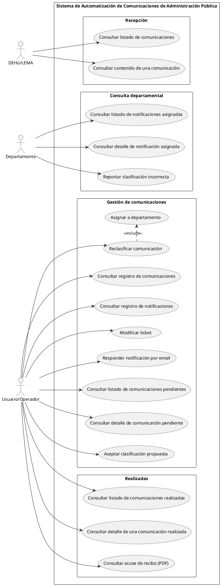

# Casos de Uso

*Formato simplificado (rol + objetivo + flujo principal + RF relacionados). Versión provisional mientras el diseño puede seguir cambiando — se ampliará a formato académico completo (precondiciones, flujos alternativos, postcondiciones) al redactar la memoria.*

Basado en `casos_de_uso_final.xml`. Actores: **DEHú/LEMA**, **Departamento**, **Usuario/Operador** (llamado "USUARIO" en el diagrama).

---

## Paquete: Recepción

### CU1 — Consultar listado de comunicaciones
**Actor:** DEHú/LEMA
**Objetivo:** Obtener el listado de comunicaciones pendientes de acceso.
**Flujo:** El sistema invoca `localiza()` periódicamente y recibe los identificadores y metadatos básicos (concepto, organismo emisor) de cada comunicación pendiente.
**RF:** RF-01.1, RF-01.2

### CU2 — Consultar contenido de una comunicación
**Actor:** DEHú/LEMA
**Objetivo:** Acceder al contenido (documento + anexos) de una comunicación concreta.
**Flujo:** El sistema invoca `peticionAcceso()` para cada comunicación detectada, obteniendo el documento principal y las referencias a sus anexos.
**RF:** RF-01.2, RF-02.1, RF-02.2

---

## Paquete: Consulta departamental

### CU5 — Consultar listado de notificaciones asignadas
**Actor:** Departamento
**Objetivo:** Ver las comunicaciones que le han sido derivadas.
**Flujo:** El Departamento consulta, desde el frontal propio, el listado de tickets/derivaciones asignados a su cola.
**RF:** Consumo del resultado de RF-08 (sin número de RF propio en la especificación actual)

### CU6 — Consultar detalle de notificación asignada
**Actor:** Departamento
**Objetivo:** Ver el detalle completo de una comunicación ya derivada.
**Flujo:** El Departamento abre una notificación de su listado y consulta su contenido estructurado (RF-06.1).
**RF:** Consumo del resultado de RF-08

### CU11 — Reportar clasificación incorrecta
**Actor:** Departamento
**Objetivo:** Indicar que una comunicación fue derivada al departamento/cola equivocado.
**Flujo:** El Departamento cancela la notificación asignada, lo que genera el evento que dispara RF-10 (reclasificación automática vía Agente IA).
**RF:** RF-10.1

---

## Paquete: Gestión de comunicaciones

### CU3a — Consultar listado de comunicaciones pendientes
**Actor:** Usuario/Operador
**Objetivo:** Ver las comunicaciones que están en cola de revisión humana.
**Flujo:** El Operador consulta la lista de comunicaciones con confianza de clasificación por debajo del umbral (RF-05.3).
**RF:** RF-09.1

### CU3b — Consultar detalle de comunicación pendiente
**Actor:** Usuario/Operador
**Objetivo:** Ver el documento, texto extraído y clasificación propuesta de una comunicación en revisión, para poder decidir.
**Flujo:** El Operador abre una comunicación de la cola de revisión (CU3a) y consulta el material necesario para resolverla.
**RF:** RF-09.2

### CU4a — Aceptar clasificación propuesta
**Actor:** Usuario/Operador
**Objetivo:** Confirmar que la propuesta de clasificación de la IA es correcta.
**Flujo:** El Operador acepta la propuesta desde CU3b, disparando la acción normal (RF-08) con la clasificación sin modificar.
**RF:** RF-09.5

### CU4b — Reclasificar comunicación
**Actor:** Usuario/Operador
**Objetivo:** Corregir manualmente el departamento y/o tipo de una comunicación mal clasificada.
**Flujo:** El Operador indica el departamento/tipo correcto desde CU3b; el sistema ejecuta **Asignar a departamento** (CU4c, `<<include>>`) para derivar la comunicación al destino correcto.
**RF:** RF-09.6

### CU4c — Asignar a departamento
**Actor:** Incluido por CU4b (no invocado directamente por un actor)
**Objetivo:** Ejecutar la derivación de la comunicación al departamento correcto tras una reclasificación manual.
**Flujo:** Aplica la lógica de RF-08.5/RF-11.5: si cambia la cola destino, finaliza el ticket original y crea uno nuevo, enlazados por `ticketRelacionado`.
**RF:** RF-08.5, RF-09.6

### CU8 — Consultar registro de comunicaciones
**Actor:** Usuario/Operador
**Objetivo:** Consultar comunicaciones ya almacenadas en el repositorio local, sin invocar a DEHú.
**Flujo:** El Operador busca y visualiza el registro; si no tiene ninguna `DERIVACION` asociada, el resultado es de solo lectura.
**RF:** RF-11.1, RF-11.2

### CU9 — Consultar registro de notificaciones
**Actor:** Usuario/Operador
**Objetivo:** Consultar registros que ya tienen una acción de derivación (ticket) generada.
**Flujo:** El Operador busca y visualiza el registro; al tener `DERIVACION` asociada, se le ofrece la opción de modificarlo (CU10a).
**RF:** RF-11.1, RF-11.3

### CU10a — Modificar ticket
**Actor:** Usuario/Operador
**Objetivo:** Editar un ticket ya generado.
**Flujo:** Si la modificación no cambia el departamento/cola, se actualiza el ticket in-place; si sí lo cambia, se finaliza el original y se crea uno nuevo (mismo mecanismo que CU4c).
**RF:** RF-11.4, RF-11.5

### CU10b — Responder notificación por email
**Actor:** Usuario/Operador
**Objetivo:** Enviar la notificación al departamento por canal email.
**Flujo:** El Operador activa el canal email para una comunicación, como alternativa configurable o de contingencia al ticket.
**RF:** RF-08.2

---

## Paquete: Realizadas (registros locales ya procesados)

*Nota: este paquete consulta el repositorio **local** (comunicaciones ya procesadas por el propio sistema), no el servicio externo `localizaRealizadas()` de DEHú — ese servicio corresponde a RF-12 (reconciliación), fuera del alcance comprometido del MVP.*

### CU7a — Consultar listado de comunicaciones realizadas
**Actor:** Usuario/Operador
**Objetivo:** Ver el histórico de comunicaciones ya procesadas (`COMUNICACION.estado = 'procesada'`).
**RF:** RF-11.1

### CU7b — Consultar detalle de una comunicación realizada
**Actor:** Usuario/Operador
**Objetivo:** Ver el detalle completo de una comunicación ya procesada.
**RF:** RF-11.1

### CU7c — Consultar acuse de recibo (PDF)
**Actor:** Usuario/Operador
**Objetivo:** Ver/descargar el acuse almacenado de una comunicación.
**Flujo:** El Operador accede al documento de tipo `acuse` almacenado en `DOCUMENTO` durante RF-02.3.
**RF:** RF-02.3, RF-11.1

---

## Resumen de actores por caso de uso

| Actor | Casos de uso |
|---|---|
| DEHú/LEMA | CU1, CU2 |
| Departamento | CU5, CU6, CU11 |
| Usuario/Operador | CU3a, CU3b, CU4a, CU4b, CU7a, CU7b, CU7c, CU8, CU9, CU10a, CU10b |
| *(incluido, sin actor directo)* | CU4c |

---

## Diagrama

