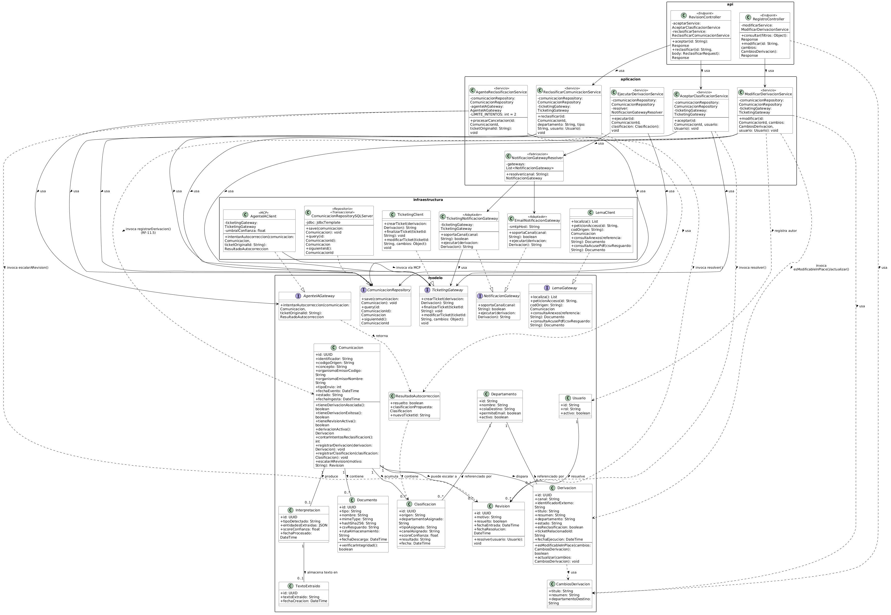

# Diagrama de clases y análisis de principios de diseño

*Estado actual: un único diagrama de clases en capas (`modelo` / `aplicacion` / `infraestructura` / `api`), que cubre las cinco rebanadas de flujo diseñadas hasta ahora — RF-09 (aceptar/reclasificar), RF-08 (ejecución de la acción resultante), RF-10 (reclasificación automática vía Agente IA), RF-11.4 (modificación in-place) y RF-11.5 (cambio de departamento, finalizar+crear) — alineadas con los patrones reales del sistema de Ticketing (CDI, Repository/Gateway a medida, JAX-RS — sin JPA, sin Spring, Java 8). RF-11.5 se diagrama como propuesta de alto nivel, no como diseño técnico cerrado (ver nota más abajo). Evaluado y descartado un diagrama de secuencia aparte para RF-10 (ver nota al final): el flujo de decisión ya está en `Diagramas_de_flujo.md` y el reparto de responsabilidad `AgenteReclasificacionService`/`AgenteIAClient` ya está explicado en prosa más abajo.*

---

## Diagrama

*Nota: la imagen debe estar en `img/diagrama_clases.png`, relativa a este `.md` — si mueves el `.md`, mueve también la carpeta `img/`.*

---

## Qué cubre cada flujo

### RF-09 — Aceptar / reclasificar (cerrada, revisión previa)

`AceptarClasificacionService` y `ReclasificarComunicacionService`, expuestas por `RevisionController`. Es la rebanada de referencia: define las interfaces (`ComunicacionRepository`, `TicketingGateway`, `LemaGateway`) que el resto reutiliza sin cambios.

### RF-08 — Ejecución de la acción resultante

`EjecutarDerivacionService` consume el evento de "comunicación clasificada" (RF-07, vía Bus de Eventos Corporativo — no hay endpoint HTTP nuevo para esta rebanada) y ejecuta la acción en el canal que ya decidió la clasificación (`Clasificacion.canalAsignado`).

**Por qué una interfaz nueva y no reutilizar `TicketingGateway`**: RF-08.4 exige que "la selección de canal debe resolverse por configuración/reglas, no por código específico de cada caso" para que añadir un canal nuevo no toque el resto del pipeline. `TicketingGateway` ya está pensada para las operaciones específicas de Ticketing (crear/finalizar/modificar un ticket concreto), no para representar "un canal de notificación genérico". Por eso se introduce `NotificacionGateway`, con una única operación (`ejecutar`) común a los canales soportados, implementada por `TicketingNotificacionGateway` (que delega en el `TicketingGateway` ya existente — patrón Adapter) y `EmailNotificacionGateway`. `EjecutarDerivacionService` no conoce ninguna clase concreta de canal: `NotificacionGatewayResolver` (GRASP Pure Fabrication) recibe todas las implementaciones registradas vía CDI (`@Inject @Any Instance<NotificacionGateway>`) y resuelve cuál usar según `canal`. Es el caso — anticipado ya en la rebanada RF-09 como pendiente — donde **OCP y Polymorphism quedan finalmente demostrados**: añadir un canal nuevo es una clase que implementa `NotificacionGateway`, sin modificar `EjecutarDerivacionService` ni `NotificacionGatewayResolver`.

**Idempotencia (RF-08.5)**: `Comunicacion.tieneDerivacionExitosa()`, distinta de `tieneDerivacionAsociada()` (usada en RF-11 para decidir solo-lectura/editable) — corrección ya anotada en `TODO.md`: una `Derivacion` con `estado='fallo'` debe permitir reintento, no bloquearlo, así que la comprobación de idempotencia mira `estado='exito'`, no solo "existe una fila".

### RF-10 — Reclasificación automática (Agente IA)

`AgenteReclasificacionService` cubre solo la parte determinista de RF-10.1-10.5: consumir el evento de cancelación (Bus de Eventos Corporativo, mismo patrón que RF-08, sin capa `api` propia), comprobar y actualizar el contador de intentos persistido (`Comunicacion.contarIntentosReclasificacion()`, Information Expert — cuenta filas de `Clasificacion` con `origen='ia_reclasificacion'`, sin campo contador aparte, coherente con `ER_Explicacion.md`), decidir si hay margen para intentar autocorrección o escalar directamente, y resolver la escalada (`Comunicacion.escalarARevision()`, Creator) si el agente no resuelve.

**Quién invoca el MCP**: RF-10.4 dice literalmente que *"el agente invoca — vía MCP — la acción de finalizar el ticket original y crear uno nuevo"*. Se ha modelado de forma literal: `AgenteReclasificacionService` delega en `AgenteIAGateway.intentarAutocorreccion(...)` tanto la generación de la propuesta como, si la confianza supera el umbral, la propia invocación de `TicketingGateway` (finalizar+crear). Por eso es `AgenteIAClient` (infraestructura, `<<MCP>>`) quien depende de `TicketingGateway`, no el Service — modela que es el agente (razonamiento + *tool-calling* autónomo) quien decide y actúa, no código determinista nuestro comparando un score contra un umbral. `ResultadoAutocorreccion` es el *value object* que le permite a `AgenteReclasificacionService` saber qué pasó sin conocer el umbral ni el detalle de la llamada MCP. **Esta es una decisión de diseño razonada pero no confirmada con nadie del equipo** — igual que el resto de RF-10.1 (ver `TODO.md`).

### RF-11.4 — Modificación in-place

`ModificarDerivacionService`, expuesto por `RegistroController` junto con la consulta de RF-11.1-11.3 (que reutiliza `Comunicacion.tieneDerivacionAsociada()` para la distinción solo-lectura/editable). `Derivacion.esModificableInPlace(cambios)` es Information Expert: `Derivacion` es quien tiene el campo `departamento`, así que es quien sabe si un cambio propuesto lo altera o no. Cuando da `true`, `Derivacion.actualizar(cambios)` aplica el cambio de `titulo`/`resumen` y `ModificarDerivacionService` delega en `TicketingGateway.modificarTicket()`. Cuando da `false`, la rama correcta es RF-11.5 (ver siguiente apartado).

### RF-11.5 — Cambio de departamento (finalizar + crear)

Cuando `Derivacion.esModificableInPlace(cambios)` da `false` — el `cambios.departamentoDestino` propuesto por el Operador es distinto del `departamento` actual de la `Derivacion` —, `ModificarDerivacionService` no llama a `TicketingGateway.modificarTicket()`, sino que reutiliza literalmente el mismo mecanismo ya cerrado en RF-09.6 (`ReclasificarComunicacionService`) y RF-10.4 (`AgenteIAClient`): `TicketingGateway.finalizarTicket(derivacion.identificadorExterno)` para cerrar el ticket original, seguido de `TicketingGateway.crearTicket(nuevaDerivacion)` para abrir uno nuevo en la cola correcta. La nueva `Derivacion` se crea con `Comunicacion.registrarDerivacion(...)` (Creator, ya establecido desde RF-09), marcada con `esReclasificacion = true` y `ticketRelacionadoId` apuntando al ticket original — los mismos dos campos que ya estaban en el ER (`ER_Explicacion.md`) precisamente para cubrir este caso, confirmado con Dani, y que hasta ahora solo se usaban desde RF-09.6/RF-10.4.

**Se diagrama como propuesta de alto nivel, no como diseño técnico cerrado** — misma cautela que ya declaraba la nota de diseño de RF-11 en `Especificacion_Requisitos.md`: sigue condicionada a que se confirme la disponibilidad real de la API "audiencia back" de Ticketing y sus capacidades exactas (ver `Especificacion_Requisitos.md`, sección 6, tabla de riesgos). Deliberadamente **no** se introduce todavía un colaborador compartido que unifique los tres sitios que reconstruyen este mismo mecanismo (RF-09.6, RF-10.4, RF-11.5) — sigue siendo, como ya se apuntaba antes de diagramar esta rebanada, un candidato razonable pero no forzado mientras sean solo tres usos concretos y no haya señal de que vaya a crecer (YAGNI).

---

## Análisis SOLID (consolidado, las cinco rebanadas)

### S — Single Responsibility Principle

Cada clase tiene un único motivo de cambio: `AceptarClasificacionService` solo cambia si cambia "aceptar"; `EjecutarDerivacionService` solo si cambia cómo se ejecuta una derivación ya clasificada; `AgenteReclasificacionService` solo si cambia la orquestación determinista de RF-10; `ModificarDerivacionService` solo si cambia la lógica de "modificar". Ninguna mezcla persistencia, llamadas externas y reglas de negocio no relacionadas entre sí.

### O — Open/Closed Principle

**Demostrado**, en RF-08: `NotificacionGateway` permite añadir un canal de notificación nuevo creando una clase que la implemente, sin modificar `EjecutarDerivacionService` ni `NotificacionGatewayResolver`.

### L — Liskov Substitution Principle

`TicketingNotificacionGateway` y `EmailNotificacionGateway` son sustituibles entre sí allí donde se espera un `NotificacionGateway` (el Resolver no distingue); `AgenteIAClient` sustituye a `AgenteIAGateway` sin que `AgenteReclasificacionService` lo note — permite, en un test, sustituir el agente real por uno simulado. Mismo criterio que ya regía `ComunicacionRepository`/`TicketingGateway`/`LemaGateway` desde RF-09.

### I — Interface Segregation Principle

Interfaces pequeñas y separadas por propósito: `NotificacionGateway` (2 métodos), `AgenteIAGateway` (1 método), igual de acotadas que `TicketingGateway`/`LemaGateway`/`ComunicacionRepository`. Ningún Service depende de métodos que no usa — `ModificarDerivacionService` usa `modificarTicket()` en la rama RF-11.4 y `finalizarTicket()`/`crearTicket()` en la rama RF-11.5, pero la interfaz sigue siendo una sola porque las tres operaciones pertenecen al mismo concepto (gestión de un ticket) y ya las usa también `ReclasificarComunicacionService` (RF-09.6) sin que eso obligue a partir `TicketingGateway`.

### D — Dependency Inversion Principle

El más trabajado de los cinco: los seis Services de `aplicacion` dependen únicamente de interfaces de `modelo` — nunca de las clases concretas de `infraestructura`. La única aparente excepción — `AgenteIAClient` dependiendo de `TicketingGateway` — sigue cumpliendo DIP: es una clase de `infraestructura` dependiendo de una interfaz de `modelo`, no al revés.

---

## Análisis GRASP (consolidado, las cinco rebanadas)

### Information Expert

`Revision.resolver(usuario)`, `Documento.verificarIntegridad()`, `Comunicacion.tieneDerivacionAsociada()`/`tieneDerivacionExitosa()`/`tieneRevisionActiva()`/`contarIntentosReclasificacion()`, `Derivacion.esModificableInPlace()` — en todos los casos, la clase que posee el dato es la que responde sobre él, no el Service que la invoca.

### Creator

`Comunicacion`, como raíz de las relaciones 1:N, crea sus propios `Documento`, `Clasificacion`, `Derivacion` y `Revision` (`registrarDerivacion()`, `registrarClasificacion()`, `escalarARevision()`) — ninguna de estas cuatro clases tiene sentido ni ciclo de vida fuera del contexto de una `Comunicacion` concreta.

### Low Coupling / High Cohesion

Bajo acoplamiento vía `TicketingGateway`/`LemaGateway`/`NotificacionGateway`/`AgenteIAGateway` (ver DIP) — `aplicacion` no conoce ningún detalle técnico de `infraestructura`. Alta cohesión: cada Service hace una sola cosa relacionada consigo misma.

### Controller

`RevisionController` y `RegistroController` cumplen el rol GRASP de Controller: reciben la petición HTTP, pero no contienen lógica de negocio — delegan inmediatamente en el Service correspondiente.

### Pure Fabrication

`NotificacionGatewayResolver` no representa ningún concepto del dominio de negocio — es una clase inventada puramente por razones de diseño (desacoplar selección de ejecución). No hacía falta en RF-09 porque con una única implementación de cada interfaz no hay nada que "resolver".

### Polymorphism

**Demostrado**, en RF-08: `NotificacionGatewayResolver` invoca `soportaCanal()` y `ejecutar()` sobre una referencia de tipo `NotificacionGateway` sin saber en tiempo de compilación cuál de las implementaciones responderá — selección en tiempo de ejecución.

---

## Patrones de diseño aplicados (GoF / PoEAA)

*Distinto del análisis SOLID/GRASP anterior: SOLID son principios, GRASP son responsabilidades; esta sección nombra los patrones de diseño concretos (catálogo GoF y patrones de arquitectura empresarial de Fowler) que esas decisiones terminan realizando. Se documentan también los patrones que a primera vista podrían parecer aplicados pero no lo están, para dejar explícita la decisión de simplicidad (KISS/YAGNI).*

### Aplicados

**Strategy** — `NotificacionGateway` define un comportamiento intercambiable (`ejecutar()`), con una implementación distinta por canal (`TicketingNotificacionGateway`, `EmailNotificacionGateway`) seleccionada en tiempo de ejecución por `NotificacionGatewayResolver` según `Clasificacion.canalAsignado`. Es la misma decisión de diseño que demuestra OCP y Polymorphism en el análisis GRASP — Strategy es el nombre del patrón catálogo; OCP/Polymorphism son los principios que ese patrón satisface.

**Adapter** — `TicketingNotificacionGateway` (ya etiquetada `<<Adaptador>>` en el diagrama) adapta la interfaz específica de Ticketing (`TicketingGateway`: crear/finalizar/modificar un ticket concreto) a la interfaz genérica de canal (`NotificacionGateway`: `ejecutar()`), sin modificar `TicketingGateway`.

**Gateway** *(patrón de arquitectura empresarial, Fowler — PoEAA, no GoF)* — `TicketingGateway`, `LemaGateway` y `AgenteIAGateway` encapsulan el acceso a cada sistema externo (Ticketing, LEMA/DEHú, Agente IA vía MCP) tras una interfaz mínima que oculta el protocolo real (REST, SOAP+WS-Security, MCP) al resto del sistema.

**Repository** *(patrón de arquitectura empresarial, Fowler — PoEAA, no GoF)* — `ComunicacionRepository` abstrae la persistencia tras una interfaz orientada al dominio (`save`, `query`, `siguienteId`), sin exponer detalles de SQL Server ni de `JdbcTemplate`.

### Evaluados y descartados (documentado explícitamente, no es una omisión)

**Observer** — el sistema es dirigido por eventos a **nivel de arquitectura** (Bus de Eventos Corporativo, ver `Diagrama_Componentes.md`), pero esto no se traduce en un patrón Observador a **nivel de diagrama de clases**: no existe una clase Sujeto/Observable con una lista de observadores ni un método `notify()`. La publicación y el consumo de eventos ocurren a través de infraestructura externa (n8n + bus), no de una relación de clases dentro de este diagrama. Se documenta la distinción para no confundir "arquitectura orientada a eventos" con "patrón Observador aplicado".

**State** — los campos `estado` de `Comunicacion` y `Derivacion` son cadenas de texto simples (`pendiente`, `en_proceso`, `en_revision`, `procesada`, etc.), no una jerarquía de clases por estado con comportamiento polimórfico. Aplicar State habría significado una clase por cada valor de estado, cada una redefiniendo el comportamiento correspondiente — deliberadamente descartado por KISS/YAGNI: el número de estados es pequeño y estable, y no hay comportamiento complejo asociado a cada transición que justifique el coste añadido.

**Factory Method** — `NotificacionGatewayResolver` podría confundirse con una fábrica, pero no instancia objetos: selecciona entre instancias ya creadas e inyectadas por CDI (`@Inject @Any Instance<NotificacionGateway>`). Es la mitad "selectora" del patrón Strategy, no una Fábrica.

### Tabla resumen

| Patrón | Catálogo | ¿Aplicado? | Dónde / por qué no |
|---|---|---|---|
| Strategy | GoF | Sí | `NotificacionGateway` + implementaciones, seleccionadas por `NotificacionGatewayResolver` |
| Adapter | GoF | Sí | `TicketingNotificacionGateway` adapta `TicketingGateway` a `NotificacionGateway` |
| Gateway | PoEAA (Fowler) | Sí | `TicketingGateway`, `LemaGateway`, `AgenteIAGateway` |
| Repository | PoEAA (Fowler) | Sí | `ComunicacionRepository` |
| Observer | GoF | No | Event-driven a nivel de arquitectura (bus de eventos), no modelado como relación de clases |
| State | GoF | No | Estado modelado como `String`, no como jerarquía de clases — KISS/YAGNI |
| Factory Method | GoF | No | `NotificacionGatewayResolver` selecciona, no instancia — es Strategy, no Factory |

---

## Resumen

| Principio | ¿Demostrado? | Dónde |
|---|---|---|
| SRP | Sí | Cada Service, cada Repository/Gateway |
| OCP | Sí | RF-08 — `NotificacionGateway` y sus implementaciones (ticket, email) |
| LSP | Sí | `*Repository`/`*Gateway` y sus implementaciones |
| ISP | Sí | Interfaces pequeñas y separadas por propósito |
| DIP | Sí | `aplicacion` → interfaces de `modelo`, nunca clases de `infraestructura` |
| Information Expert | Sí | `Revision.resolver()`, `Comunicacion.contarIntentosReclasificacion()`, `Derivacion.esModificableInPlace()`, etc. |
| Creator | Sí | `Comunicacion` como raíz de las relaciones 1:N |
| Low Coupling / High Cohesion | Sí | Separación de capas + Gateways + Resolver |
| Controller | Sí | `RevisionController`, `RegistroController` |
| Pure Fabrication | Sí | `NotificacionGatewayResolver` |
| Polymorphism | Sí | RF-08 — selección de canal en tiempo de ejecución |

---

## Pendiente (traspasado a `TODO.md`)

- RF-11.5 ya está diagramada (finalizar+crear, reutilizando el mecanismo de RF-09.6/RF-10.4) pero como propuesta de alto nivel — pendiente de cerrar el diseño técnico cuando se confirme la API "audiencia back" de Ticketing; candidato a extraer como colaborador compartido si el número de sitios que reconstruyen el mecanismo crece más allá de los tres actuales (RF-09.6, RF-10.4, RF-11.5).
- ~~Evaluar si hace falta un diagrama de secuencia específico para RF-10~~ — **Evaluado y descartado**: el flujo de decisión (contador de intentos, umbral de confianza, éxito/escalada) ya está representado en `Diagramas_de_flujo.md` (flujo 2, "Departamento + Autocorrección"); el único aporte adicional de un diagrama de secuencia sería formalizar que es `AgenteIAClient` (no `AgenteReclasificacionService`) quien invoca `TicketingGateway`, y eso ya está explicado en prosa en la nota "Quién invoca el MCP" más arriba. Añadir un quinto diagrama que repite la misma información en otra notación no aporta lo suficiente, más aún tratándose de una decisión no confirmada con el equipo (ver punto siguiente) que podría quedar obsoleta.
- La decisión de que sea `AgenteIAClient` (no `AgenteReclasificacionService`) quien invoque `TicketingGateway` vía MCP es razonamiento propio a partir de la literalidad de RF-10.4, no algo confirmado con nadie del equipo — revisar si se sostiene cuando se aborde la implementación real del agente.

---

## Código PlantUML

```plantuml
@startuml diagrama_clases_completo_DEHu

skinparam classAttributeIconSize 0
skinparam class {
    BackgroundColor White
    ArrowColor Black
    BorderColor Black
}
skinparam packageStyle rectangle
skinparam wrapWidth 200
skinparam nodesep 35
skinparam ranksep 45

package "modelo" {

    class Comunicacion {
        +id: UUID
        +identificador: String
        +codigoOrigen: String
        +concepto: String
        +organismoEmisorCodigo: String
        +organismoEmisorNombre: String
        +tipoEnvio: int
        +fechaEvento: DateTime
        +estado: String
        +fechaIngesta: DateTime
        --
        +tieneDerivacionAsociada(): boolean
        +tieneDerivacionExitosa(): boolean
        +tieneRevisionActiva(): boolean
        +derivacionActiva(): Derivacion
        +contarIntentosReclasificacion(): int
        +registrarDerivacion(derivacion: Derivacion): void
        +registrarClasificacion(clasificacion: Clasificacion): void
        +escalarARevision(motivo: String): Revision
    }

    class Documento {
        +id: UUID
        +tipo: String
        +nombre: String
        +mimeType: String
        +hashSha256: String
        +csvResguardo: String
        +rutaAlmacenamiento: String
        +fechaDescarga: DateTime
        --
        +verificarIntegridad(): boolean
    }

    class Interpretacion {
        +id: UUID
        +textoExtraido: String
        +tipoDetectado: String
        +entidadesExtraidas: JSON
        +scoreConfianza: float
        +fechaProcesado: DateTime
    }

    class Clasificacion {
        +id: UUID
        +origen: String
        +departamentoAsignado: String
        +tipoAsignado: String
        +canalAsignado: String
        +scoreConfianza: float
        +resultado: String
        +fecha: DateTime
    }

    class Derivacion {
        +id: UUID
        +canal: String
        +identificadorExterno: String
        +titulo: String
        +resumen: String
        +departamento: String
        +estado: String
        +esReclasificacion: boolean
        +ticketRelacionadoId: String
        +fechaEjecucion: DateTime
        --
        +esModificableInPlace(cambios: CambiosDerivacion): boolean
        +actualizar(cambios: CambiosDerivacion): void
    }

    class Revision {
        +id: UUID
        +motivo: String
        +resuelto: boolean
        +fechaEntrada: DateTime
        +fechaResolucion: DateTime
        --
        +resolver(usuario: Usuario): void
    }

    class Departamento {
        +id: String
        +nombre: String
        +colaDestino: String
        +permiteEmail: boolean
        +activo: boolean
    }

    class Usuario {
        +id: String
        +rol: String
        +activo: boolean
    }

    class CambiosDerivacion {
        +titulo: String
        +resumen: String
        +departamentoDestino: String
    }

    class ResultadoAutocorreccion {
        +resuelto: boolean
        +clasificacionPropuesta: Clasificacion
        +nuevoTicketId: String
    }

    interface ComunicacionRepository {
        +save(comunicacion: Comunicacion): void
        +query(id: ComunicacionId): Comunicacion
        +siguienteId(): ComunicacionId
    }

    interface TicketingGateway {
        +crearTicket(derivacion: Derivacion): String
        +finalizarTicket(ticketId: String): void
        +modificarTicket(ticketId: String, cambios: Object): void
    }

    interface LemaGateway {
        +localiza(): List
        +peticionAcceso(id: String, codOrigen: String): Comunicacion
        +consultaAnexos(referencia: String): Documento
        +consultaAcusePdf(csvResguardo: String): Documento
    }

    interface NotificacionGateway {
        +soportaCanal(canal: String): boolean
        +ejecutar(derivacion: Derivacion): String
    }

    interface AgenteIAGateway {
        +intentarAutocorreccion(comunicacion: Comunicacion, ticketOriginalId: String): ResultadoAutocorreccion
    }

    Comunicacion "1" -- "0..*" Documento : contiene >
    Comunicacion "1" -- "0..1" Interpretacion : produce >
    Comunicacion "1" -- "0..*" Clasificacion : acumula >
    Comunicacion "1" -- "0..*" Derivacion : dispara >
    Comunicacion "1" -- "0..*" Revision : puede escalar a >
    Usuario "1" -- "0..*" Revision : resuelve >
    Departamento "1" -- "0..*" Clasificacion : < referenciado por
    Departamento "1" -- "0..*" Derivacion : < referenciado por
    Derivacion ..> CambiosDerivacion : usa >
    ResultadoAutocorreccion ..> Clasificacion : contiene >
    AgenteIAGateway ..> ResultadoAutocorreccion : retorna >
}

package "aplicacion" {

    class AceptarClasificacionService <<Servicio>> {
        -comunicacionRepository: ComunicacionRepository
        -ticketingGateway: TicketingGateway
        --
        +aceptar(id: ComunicacionId, usuario: Usuario): void
    }

    class ReclasificarComunicacionService <<Servicio>> {
        -comunicacionRepository: ComunicacionRepository
        -ticketingGateway: TicketingGateway
        --
        +reclasificar(id: ComunicacionId, departamento: String, tipo: String, usuario: Usuario): void
    }

    class EjecutarDerivacionService <<Servicio>> {
        -comunicacionRepository: ComunicacionRepository
        -resolver: NotificacionGatewayResolver
        --
        +ejecutar(id: ComunicacionId, clasificacion: Clasificacion): void
    }

    class NotificacionGatewayResolver <<Fabricacion>> {
        -gateways: List<NotificacionGateway>
        --
        +resolver(canal: String): NotificacionGateway
    }

    class AgenteReclasificacionService <<Servicio>> {
        -comunicacionRepository: ComunicacionRepository
        -agenteIAGateway: AgenteIAGateway
        -LIMITE_INTENTOS: int = 2
        --
        +procesarCancelacion(id: ComunicacionId, ticketOriginalId: String): void
    }

    class ModificarDerivacionService <<Servicio>> {
        -comunicacionRepository: ComunicacionRepository
        -ticketingGateway: TicketingGateway
        --
        +modificar(id: ComunicacionId, cambios: CambiosDerivacion, usuario: Usuario): void
    }

    EjecutarDerivacionService --> NotificacionGatewayResolver : usa >
    ModificarDerivacionService ..> CambiosDerivacion : usa >
    AgenteReclasificacionService ..> ResultadoAutocorreccion : usa >
}

package "infraestructura" {

    class ComunicacionRepositorySQLServer <<Repositorio>> <<Transaccional>> {
        -jdbc: JdbcTemplate
        --
        +save(comunicacion: Comunicacion): void
        +query(id: ComunicacionId): Comunicacion
        +siguienteId(): ComunicacionId
    }
    ComunicacionRepositorySQLServer ..|> ComunicacionRepository

    class LemaClient {
        +localiza(): List
        +peticionAcceso(id: String, codOrigen: String): Comunicacion
        +consultaAnexos(referencia: String): Documento
        +consultaAcusePdf(csvResguardo: String): Documento
    }
    LemaClient ..|> LemaGateway

    class TicketingClient {
        +crearTicket(derivacion: Derivacion): String
        +finalizarTicket(ticketId: String): void
        +modificarTicket(ticketId: String, cambios: Object): void
    }
    TicketingClient ..|> TicketingGateway

    class TicketingNotificacionGateway <<Adaptador>> {
        -ticketingGateway: TicketingGateway
        --
        +soportaCanal(canal: String): boolean
        +ejecutar(derivacion: Derivacion): String
    }
    TicketingNotificacionGateway ..|> NotificacionGateway
    TicketingNotificacionGateway --> TicketingGateway : usa >

    class EmailNotificacionGateway <<Adaptador>> {
        -smtpHost: String
        --
        +soportaCanal(canal: String): boolean
        +ejecutar(derivacion: Derivacion): String
    }
    EmailNotificacionGateway ..|> NotificacionGateway

    class AgenteIAClient <<MCP>> {
        -ticketingGateway: TicketingGateway
        -umbralConfianza: float
        --
        +intentarAutocorreccion(comunicacion: Comunicacion, ticketOriginalId: String): ResultadoAutocorreccion
    }
    AgenteIAClient ..|> AgenteIAGateway
    AgenteIAClient --> TicketingGateway : invoca vía MCP >

    NotificacionGatewayResolver --> TicketingNotificacionGateway
    NotificacionGatewayResolver --> EmailNotificacionGateway
}

package "api" {

    class RevisionController <<Endpoint>> {
        -aceptarService: AceptarClasificacionService
        -reclasificarService: ReclasificarComunicacionService
        --
        +aceptar(id: String): Response
        +reclasificar(id: String, body: ReclasificarRequest): Response
    }

    class RegistroController <<Endpoint>> {
        -modificarService: ModificarDerivacionService
        --
        +consultar(filtros: Object): Response
        +modificar(id: String, cambios: CambiosDerivacion): Response
    }
}

RevisionController --> AceptarClasificacionService : usa >
RevisionController --> ReclasificarComunicacionService : usa >
RegistroController --> ModificarDerivacionService : usa >
RegistroController ..> CambiosDerivacion : usa >

AceptarClasificacionService --> ComunicacionRepository : usa >
ReclasificarComunicacionService --> ComunicacionRepository : usa >
EjecutarDerivacionService --> ComunicacionRepository : usa >
AgenteReclasificacionService --> ComunicacionRepository : usa >
ModificarDerivacionService --> ComunicacionRepository : usa >

AceptarClasificacionService --> TicketingGateway : usa >
ReclasificarComunicacionService --> TicketingGateway : usa >
ModificarDerivacionService --> TicketingGateway : usa >

AgenteReclasificacionService --> AgenteIAGateway : usa >

AceptarClasificacionService ..> Revision : invoca resolver() >
ReclasificarComunicacionService ..> Revision : invoca resolver() >
AgenteReclasificacionService ..> Revision : invoca escalarARevision() >
ModificarDerivacionService ..> Derivacion : invoca esModificableInPlace()/actualizar() >
ModificarDerivacionService ..> Comunicacion : invoca registrarDerivacion() (RF-11.5) >
ModificarDerivacionService ..> Usuario : registra autor >

@enduml
```

