# Diagrama de clases y análisis de principios de diseño

*Estado actual: rebanada vertical del flujo RF-09 (aceptar/reclasificar), con capas `modelo` / `aplicacion` / `infraestructura` / `api`, alineadas con los patrones reales del sistema de Ticketing (CDI, Repository/Gateway a medida, JAX-RS — sin JPA, sin Spring, Java 8).*

---

## Diagrama

*Nota: la imagen debe estar en `img/diagrama_clases.png`, relativa a este `.md` — si mueves el `.md`, mueve también la carpeta `img/`.*

---

## Análisis SOLID

### S — Single Responsibility Principle

Cada clase tiene un único motivo de cambio:
- `AceptarClasificacionService` solo cambia si cambia la lógica de "aceptar" (RF-09.5).
- `ReclasificarComunicacionService` solo cambia si cambia la de "reclasificar" (RF-09.6).
- `ComunicacionRepositorySQLServer` solo se ocupa de persistencia — no contiene lógica de negocio.

### O — Open/Closed Principle

**No está demostrado todavía en esta rebanada del diagrama** — es una limitación honesta, no un olvido: RF-09 (aceptar/reclasificar) no tiene variantes de comportamiento por tipo, así que no hay nada que "abrir a extensión" aquí. El caso real donde este proyecto necesita OCP es RF-08.4 (selección de canal de notificación: ticket/email/buzón), que corresponde a una capa vertical distinta, todavía no diagramada. Ahí se aplicaría mediante polimorfismo (ver sección GRASP).

### L — Liskov Substitution Principle

`ComunicacionRepositorySQLServer` debe poder sustituir a `ComunicacionRepository` en cualquier contexto sin romper el comportamiento esperado por quien la usa (`AceptarClasificacionService`) — mismo contrato para `TicketingClient`/`TicketingGateway` y `LemaClient`/`LemaGateway`. Es lo que permite, en un test, sustituir cualquiera de las tres implementaciones reales por una versión falsa sin que el código que las usa note la diferencia.

### I — Interface Segregation Principle

Las interfaces son pequeñas y están segregadas por responsabilidad, no hay una interfaz "monolito" que mezcle persistencia, Ticketing y LEMA:
- `ComunicacionRepository` — solo persistencia de `Comunicacion`.
- `TicketingGateway` — solo lo que se necesita de Ticketing (3 métodos).
- `LemaGateway` — solo las 4 llamadas SOAP de LEMA.

Ningún Service se ve obligado a depender de métodos que no usa.

### D — Dependency Inversion Principle

El más trabajado de los cinco en este diagrama. `AceptarClasificacionService` y `ReclasificarComunicacionService` (capa `aplicacion`, alto nivel) dependen únicamente de interfaces definidas en `modelo` (`ComunicacionRepository`, `TicketingGateway`) — nunca de las clases concretas de `infraestructura` (`ComunicacionRepositorySQLServer`, `TicketingClient`). Son las implementaciones concretas las que dependen del contrato (`... ..|> ...`), no al revés — de ahí la "inversión". Esto se corrigió explícitamente durante el diseño: la primera versión tenía `TicketingGateway` sin interfaz, dependencia directa a `TicketingClient`, inconsistente con el tratamiento ya dado a `ComunicacionRepository`.

---

## Análisis GRASP

### Information Expert

- `Revision.resolver(usuario)` — vive en `Revision` porque es quien posee `resuelto`, `fechaResolucion`; es la clase "experta" en su propio estado, no el Service que la invoca.
- `Documento.verificarIntegridad()` — `Documento` es quien tiene `hashSha256`, así que es quien debe saber verificarse a sí mismo (RF-02.4).
- `Comunicacion.tieneDerivacionAsociada()` / `tieneRevisionActiva()` — `Comunicacion` es dueña de las colecciones de `Derivacion` y `Revision`, así que es la experta en responder sobre su propio estado derivado.

### Creator

`Comunicacion`, como raíz de la relación 1:N, es la responsable natural de crear sus propios `Documento`, `Clasificacion`, `Derivacion` y `Revision` — coherente con que estas cuatro clases no tienen sentido ni ciclo de vida fuera del contexto de una `Comunicacion` concreta.

### Low Coupling / High Cohesion

- **Bajo acoplamiento:** logrado explícitamente con `TicketingGateway`/`LemaGateway` (ver DIP arriba) — `aplicacion` no conoce ningún detalle técnico de `infraestructura`.
- **Alta cohesión:** cada Service hace una sola cosa relacionada consigo misma (aceptar, o reclasificar) — no hay una clase "todo en uno" que mezcle validación, persistencia y llamadas externas sin relación entre sí.

### Controller

`RevisionController` cumple el rol GRASP de Controller: recibe la petición HTTP, pero no contiene lógica de negocio — delega inmediatamente en `AceptarClasificacionService`/`ReclasificarComunicacionService`. No hay validaciones de dominio ni llamadas a `TicketingGateway` directamente desde `api`.

### Polymorphism

**No representado en el diagrama actual** — cada interfaz (`ComunicacionRepository`, `TicketingGateway`, `LemaGateway`) tiene una única implementación real. El polimorfismo como mecanismo de diseño (múltiples implementaciones intercambiables seleccionadas en tiempo de ejecución) aplicaría al diseñar RF-08.4 (selección de canal), con una interfaz `NotificacionGateway` implementada por `TicketingNotificacionGateway`, `EmailNotificacionGateway`, `BuzonNotificacionGateway` — pendiente de diagramar como su propia capa vertical.

---

## Resumen

| Principio | ¿Demostrado en este diagrama? | Dónde |
|---|---|---|
| SRP | Sí | Cada Service, cada Repository |
| OCP | No, pendiente | RF-08.4 (capa vertical futura) |
| LSP | Sí | `*Repository`/`*Gateway` + sus implementaciones |
| ISP | Sí | Tres interfaces pequeñas y separadas |
| DIP | Sí | `aplicacion` → interfaces de `modelo`, nunca clases de `infraestructura` |
| Information Expert | Sí | `Revision.resolver()`, `Documento.verificarIntegridad()` |
| Creator | Sí (implícito) | `Comunicacion` como raíz de las relaciones 1:N |
| Low Coupling / High Cohesion | Sí | Separación de capas + Gateways |
| Controller | Sí | `RevisionController` |
| Polymorphism | No, pendiente | RF-08.4 (capa vertical futura) |

---

## Código PlantUML

```plantuml
@startuml diagrama_clases_capas_dip_DEHu

skinparam classAttributeIconSize 0
skinparam class {
    BackgroundColor White
    ArrowColor Black
    BorderColor Black
}
skinparam packageStyle rectangle
skinparam padding 2

package "modelo" {

    class Comunicacion {
        +id: UUID
        +identificador: String
        +codigoOrigen: String
        +concepto: String
        +organismoEmisorCodigo: String
        +organismoEmisorNombre: String
        +tipoEnvio: int
        +fechaEvento: DateTime
        +estado: String
        +fechaIngesta: DateTime
        --
        +tieneDerivacionAsociada(): boolean
        +tieneRevisionActiva(): boolean
    }

    class Documento {
        +id: UUID
        +tipo: String
        +nombre: String
        +mimeType: String
        +hashSha256: String
        +csvResguardo: String
        +rutaAlmacenamiento: String
        +fechaDescarga: DateTime
        --
        +verificarIntegridad(): boolean
    }

    class Interpretacion {
        +id: UUID
        +textoExtraido: String
        +tipoDetectado: String
        +entidadesExtraidas: JSON
        +scoreConfianza: float
        +fechaProcesado: DateTime
    }

    class Clasificacion {
        +id: UUID
        +origen: String
        +departamentoAsignado: String
        +tipoAsignado: String
        +canalAsignado: String
        +scoreConfianza: float
        +resultado: String
        +fecha: DateTime
    }

    class Derivacion {
        +id: UUID
        +canal: String
        +identificadorExterno: String
        +titulo: String
        +resumen: String
        +estado: String
        +esReclasificacion: boolean
        +ticketRelacionadoId: String
        +fechaEjecucion: DateTime
    }

    class Revision {
        +id: UUID
        +motivo: String
        +resuelto: boolean
        +fechaEntrada: DateTime
        +fechaResolucion: DateTime
        --
        +resolver(usuario: Usuario): void
    }

    class Departamento {
        +id: String
        +nombre: String
        +colaDestino: String
        +permiteEmail: boolean
        +activo: boolean
    }

    class Usuario {
        +id: String
        +rol: String
        +activo: boolean
    }

    interface ComunicacionRepository {
        +save(comunicacion: Comunicacion): void
        +query(id: ComunicacionId): Comunicacion
        +siguienteId(): ComunicacionId
    }

    interface TicketingGateway {
        +crearTicket(derivacion: Derivacion): String
        +finalizarTicket(ticketId: String): void
        +modificarTicket(ticketId: String, cambios: Object): void
    }

    interface LemaGateway {
        +localiza(): List
        +peticionAcceso(id: String, codOrigen: String): Comunicacion
        +consultaAnexos(referencia: String): Documento
        +consultaAcusePdf(csvResguardo: String): Documento
    }

    Comunicacion "1" -- "0..*" Documento : contiene >
    Comunicacion "1" -- "0..1" Interpretacion : produce >
    Comunicacion "1" -- "0..*" Clasificacion : acumula >
    Comunicacion "1" -- "0..*" Derivacion : dispara >
    Comunicacion "1" -- "0..*" Revision : puede escalar a >
    Usuario "1" -- "0..*" Revision : resuelve >
    Departamento "1" -- "0..*" Clasificacion : < referenciado por
    Departamento "1" -- "0..*" Derivacion : < referenciado por
}

package "aplicacion" {

    class AceptarClasificacionService <<Servicio>> {
        -comunicacionRepository: ComunicacionRepository
        -ticketingGateway: TicketingGateway
        --
        +aceptar(id: ComunicacionId, usuario: Usuario): void
    }

    class ReclasificarComunicacionService <<Servicio>> {
        -comunicacionRepository: ComunicacionRepository
        -ticketingGateway: TicketingGateway
        --
        +reclasificar(id: ComunicacionId, departamento: String, tipo: String, usuario: Usuario): void
    }
}

package "infraestructura" {

    class ComunicacionRepositorySQLServer <<Repositorio>> <<Transaccional>> {
        -jdbc: JdbcTemplate
        --
        +save(comunicacion: Comunicacion): void
        +query(id: ComunicacionId): Comunicacion
        +siguienteId(): ComunicacionId
    }
    ComunicacionRepositorySQLServer ..|> ComunicacionRepository

    class LemaClient {
        +localiza(): List
        +peticionAcceso(id: String, codOrigen: String): Comunicacion
        +consultaAnexos(referencia: String): Documento
        +consultaAcusePdf(csvResguardo: String): Documento
    }
    LemaClient ..|> LemaGateway

    class TicketingClient {
        +crearTicket(derivacion: Derivacion): String
        +finalizarTicket(ticketId: String): void
        +modificarTicket(ticketId: String, cambios: Object): void
    }
    TicketingClient ..|> TicketingGateway
}

package "api" {

    class RevisionController <<Endpoint>> {
        -aceptarService: AceptarClasificacionService
        -reclasificarService: ReclasificarComunicacionService
        --
        +aceptar(id: String): Response
        +reclasificar(id: String, body: ReclasificarRequest): Response
    }
}

RevisionController --> AceptarClasificacionService : usa >
RevisionController --> ReclasificarComunicacionService : usa >
AceptarClasificacionService --> ComunicacionRepository : usa >
ReclasificarComunicacionService --> ComunicacionRepository : usa >
AceptarClasificacionService --> TicketingGateway : usa >
ReclasificarComunicacionService --> TicketingGateway : usa >
AceptarClasificacionService ..> Revision : invoca resolver() >
ReclasificarComunicacionService ..> Revision : invoca resolver() >

@enduml
```

