# Diagrama de clases y análisis de principios de diseño

*Estado actual: un único diagrama de clases en capas (`modelo` / `aplicacion` / `infraestructura` / `api`), que cubre las cuatro rebanadas de flujo diseñadas hasta ahora — RF-09 (aceptar/reclasificar), RF-08 (ejecución de la acción resultante), RF-10 (reclasificación automática vía Agente IA) y RF-11.4 (modificación in-place) — alineadas con los patrones reales del sistema de Ticketing (CDI, Repository/Gateway a medida, JAX-RS — sin JPA, sin Spring, Java 8). Pendiente: RF-11.5 (no diagramada aún, ver nota más abajo) y valorar si hace falta un diagrama de secuencia para RF-10 (ver `TODO.md`).*

---

## Diagrama

*Nota: la imagen debe estar en `img/diagrama_clases.png`, relativa a este `.md` — si mueves el `.md`, mueve también la carpeta `img/`.*

---

## Qué cubre cada flujo

### RF-09 — Aceptar / reclasificar (cerrada, revisión previa)

`AceptarClasificacionService` y `ReclasificarComunicacionService`, expuestas por `RevisionController`. Es la rebanada de referencia: define las interfaces (`ComunicacionRepository`, `TicketingGateway`, `LemaGateway`) que el resto reutiliza sin cambios.

### RF-08 — Ejecución de la acción resultante

`EjecutarDerivacionService` consume el evento de "comunicación clasificada" (RF-07, vía Bus de Eventos Corporativo — no hay endpoint HTTP nuevo para esta rebanada) y ejecuta la acción en el canal que ya decidió la clasificación (`Clasificacion.canalAsignado`).

**Por qué una interfaz nueva y no reutilizar `TicketingGateway`**: RF-08.4 exige que "la selección de canal debe resolverse por configuración/reglas, no por código específico de cada caso" para que añadir un canal nuevo no toque el resto del pipeline. `TicketingGateway` ya está pensada para las operaciones específicas de Ticketing (crear/finalizar/modificar un ticket concreto), no para representar "un canal de notificación genérico". Por eso se introduce `NotificacionGateway`, con una única operación (`ejecutar`) común a los canales soportados, implementada por `TicketingNotificacionGateway` (que delega en el `TicketingGateway` ya existente — patrón Adapter) y `EmailNotificacionGateway`. `EjecutarDerivacionService` no conoce ninguna clase concreta de canal: `NotificacionGatewayResolver` (GRASP Pure Fabrication) recibe todas las implementaciones registradas vía CDI (`@Inject @Any Instance<NotificacionGateway>`) y resuelve cuál usar según `canal`. Es el caso — anticipado ya en la rebanada RF-09 como pendiente — donde **OCP y Polymorphism quedan finalmente demostrados**: añadir un canal nuevo es una clase que implementa `NotificacionGateway`, sin modificar `EjecutarDerivacionService` ni `NotificacionGatewayResolver`.

**Idempotencia (RF-08.5)**: `Comunicacion.tieneDerivacionExitosa()`, distinta de `tieneDerivacionAsociada()` (usada en RF-11 para decidir solo-lectura/editable) — corrección ya anotada en `TODO.md`: una `Derivacion` con `estado='fallo'` debe permitir reintento, no bloquearlo, así que la comprobación de idempotencia mira `estado='exito'`, no solo "existe una fila".

### RF-10 — Reclasificación automática (Agente IA)

`AgenteReclasificacionService` cubre solo la parte determinista de RF-10.1-10.5: consumir el evento de cancelación (Bus de Eventos Corporativo, mismo patrón que RF-08, sin capa `api` propia), comprobar y actualizar el contador de intentos persistido (`Comunicacion.contarIntentosReclasificacion()`, Information Expert — cuenta filas de `Clasificacion` con `origen='ia_reclasificacion'`, sin campo contador aparte, coherente con `ER_Explicacion.md`), decidir si hay margen para intentar autocorrección o escalar directamente, y resolver la escalada (`Comunicacion.escalarARevision()`, Creator) si el agente no resuelve.

**Quién invoca el MCP**: RF-10.4 dice literalmente que *"el agente invoca — vía MCP — la acción de finalizar el ticket original y crear uno nuevo"*. Se ha modelado de forma literal: `AgenteReclasificacionService` delega en `AgenteIAGateway.intentarAutocorreccion(...)` tanto la generación de la propuesta como, si la confianza supera el umbral, la propia invocación de `TicketingGateway` (finalizar+crear). Por eso es `AgenteIAClient` (infraestructura, `<<MCP>>`) quien depende de `TicketingGateway`, no el Service — modela que es el agente (razonamiento + *tool-calling* autónomo) quien decide y actúa, no código determinista nuestro comparando un score contra un umbral. `ResultadoAutocorreccion` es el *value object* que le permite a `AgenteReclasificacionService` saber qué pasó sin conocer el umbral ni el detalle de la llamada MCP. **Esta es una decisión de diseño razonada pero no confirmada con nadie del equipo** — igual que el resto de RF-10.1 (ver `TODO.md`).

### RF-11.4 — Modificación in-place

`ModificarDerivacionService`, expuesto por `RegistroController` junto con la consulta de RF-11.1-11.3 (que reutiliza `Comunicacion.tieneDerivacionAsociada()` para la distinción solo-lectura/editable). `Derivacion.esModificableInPlace(cambios)` es Information Expert: `Derivacion` es quien tiene el campo `departamento`, así que es quien sabe si un cambio propuesto lo altera o no. Cuando da `false`, la rama correcta es RF-11.5 — el mismo mecanismo de "finalizar ticket original + crear uno nuevo" ya usado en RF-09.6 y RF-10.4 — que no se ha diagramado todavía porque sigue condicionado a que exista la API "audiencia back" de Ticketing (ver `Especificacion_Requisitos.md`, sección 6). Tres sitios distintos ya reconstruyen ese mismo mecanismo (RF-09.6, RF-10.4, y RF-11.5 cuando se cierre) — candidato razonable a extraer en un colaborador compartido más adelante, no forzado todavía.

---

## Análisis SOLID (consolidado, las cuatro rebanadas)

### S — Single Responsibility Principle

Cada clase tiene un único motivo de cambio: `AceptarClasificacionService` solo cambia si cambia "aceptar"; `EjecutarDerivacionService` solo si cambia cómo se ejecuta una derivación ya clasificada; `AgenteReclasificacionService` solo si cambia la orquestación determinista de RF-10; `ModificarDerivacionService` solo si cambia la lógica de "modificar". Ninguna mezcla persistencia, llamadas externas y reglas de negocio no relacionadas entre sí.

### O — Open/Closed Principle

**Demostrado**, en RF-08: `NotificacionGateway` permite añadir un canal de notificación nuevo creando una clase que la implemente, sin modificar `EjecutarDerivacionService` ni `NotificacionGatewayResolver`.

### L — Liskov Substitution Principle

`TicketingNotificacionGateway` y `EmailNotificacionGateway` son sustituibles entre sí allí donde se espera un `NotificacionGateway` (el Resolver no distingue); `AgenteIAClient` sustituye a `AgenteIAGateway` sin que `AgenteReclasificacionService` lo note — permite, en un test, sustituir el agente real por uno simulado. Mismo criterio que ya regía `ComunicacionRepository`/`TicketingGateway`/`LemaGateway` desde RF-09.

### I — Interface Segregation Principle

Interfaces pequeñas y separadas por propósito: `NotificacionGateway` (2 métodos), `AgenteIAGateway` (1 método), igual de acotadas que `TicketingGateway`/`LemaGateway`/`ComunicacionRepository`. Ningún Service depende de métodos que no usa — `ModificarDerivacionService` solo necesita `modificarTicket()`, pero la interfaz sigue siendo una sola porque las tres operaciones pertenecen al mismo concepto (gestión de un ticket).

### D — Dependency Inversion Principle

El más trabajado de los cinco: los seis Services de `aplicacion` dependen únicamente de interfaces de `modelo` — nunca de las clases concretas de `infraestructura`. La única aparente excepción — `AgenteIAClient` dependiendo de `TicketingGateway` — sigue cumpliendo DIP: es una clase de `infraestructura` dependiendo de una interfaz de `modelo`, no al revés.

---

## Análisis GRASP (consolidado, las cuatro rebanadas)

### Information Expert

`Revision.resolver(usuario)`, `Documento.verificarIntegridad()`, `Comunicacion.tieneDerivacionAsociada()`/`tieneDerivacionExitosa()`/`tieneRevisionActiva()`/`contarIntentosReclasificacion()`, `Derivacion.esModificableInPlace()` — en todos los casos, la clase que posee el dato es la que responde sobre él, no el Service que la invoca.

### Creator

`Comunicacion`, como raíz de las relaciones 1:N, crea sus propios `Documento`, `Clasificacion`, `Derivacion` y `Revision` (`registrarDerivacion()`, `registrarClasificacion()`, `escalarARevision()`) — ninguna de estas cuatro clases tiene sentido ni ciclo de vida fuera del contexto de una `Comunicacion` concreta.

### Low Coupling / High Cohesion

Bajo acoplamiento vía `TicketingGateway`/`LemaGateway`/`NotificacionGateway`/`AgenteIAGateway` (ver DIP) — `aplicacion` no conoce ningún detalle técnico de `infraestructura`. Alta cohesión: cada Service hace una sola cosa relacionada consigo misma.

### Controller

`RevisionController` y `RegistroController` cumplen el rol GRASP de Controller: reciben la petición HTTP, pero no contienen lógica de negocio — delegan inmediatamente en el Service correspondiente.

### Pure Fabrication

`NotificacionGatewayResolver` no representa ningún concepto del dominio de negocio — es una clase inventada puramente por razones de diseño (desacoplar selección de ejecución). No hacía falta en RF-09 porque con una única implementación de cada interfaz no hay nada que "resolver".

### Polymorphism

**Demostrado**, en RF-08: `NotificacionGatewayResolver` invoca `soportaCanal()` y `ejecutar()` sobre una referencia de tipo `NotificacionGateway` sin saber en tiempo de compilación cuál de las implementaciones responderá — selección en tiempo de ejecución.

---

## Resumen

| Principio | ¿Demostrado? | Dónde |
|---|---|---|
| SRP | Sí | Cada Service, cada Repository/Gateway |
| OCP | Sí | RF-08 — `NotificacionGateway` y sus implementaciones (ticket, email) |
| LSP | Sí | `*Repository`/`*Gateway` y sus implementaciones |
| ISP | Sí | Interfaces pequeñas y separadas por propósito |
| DIP | Sí | `aplicacion` → interfaces de `modelo`, nunca clases de `infraestructura` |
| Information Expert | Sí | `Revision.resolver()`, `Comunicacion.contarIntentosReclasificacion()`, `Derivacion.esModificableInPlace()`, etc. |
| Creator | Sí | `Comunicacion` como raíz de las relaciones 1:N |
| Low Coupling / High Cohesion | Sí | Separación de capas + Gateways + Resolver |
| Controller | Sí | `RevisionController`, `RegistroController` |
| Pure Fabrication | Sí | `NotificacionGatewayResolver` |
| Polymorphism | Sí | RF-08 — selección de canal en tiempo de ejecución |

---

## Pendiente (traspasado a `TODO.md`)

- RF-11.5 (cambio de departamento vía RF-11) no está diagramada — reutiliza el mecanismo ya cerrado en RF-09.6/RF-10.4; candidato a extraer como colaborador compartido si se cierra la API "audiencia back" de Ticketing.
- Evaluar si hace falta un diagrama de secuencia específico para RF-10, dado que el reparto de responsabilidades entre `AgenteReclasificacionService` y `AgenteIAGateway`/MCP no es evidente solo con el diagrama de clases.
- La decisión de que sea `AgenteIAClient` (no `AgenteReclasificacionService`) quien invoque `TicketingGateway` vía MCP es razonamiento propio a partir de la literalidad de RF-10.4, no algo confirmado con nadie del equipo — revisar si se sostiene cuando se aborde la implementación real del agente.

---

## Código PlantUML

```plantuml
@startuml diagrama_clases_completo_DEHu

skinparam classAttributeIconSize 0
skinparam class {
    BackgroundColor White
    ArrowColor Black
    BorderColor Black
}
skinparam packageStyle rectangle
skinparam wrapWidth 200
skinparam nodesep 35
skinparam ranksep 45

package "modelo" {

    class Comunicacion {
        +id: UUID
        +identificador: String
        +codigoOrigen: String
        +concepto: String
        +organismoEmisorCodigo: String
        +organismoEmisorNombre: String
        +tipoEnvio: int
        +fechaEvento: DateTime
        +estado: String
        +fechaIngesta: DateTime
        --
        +tieneDerivacionAsociada(): boolean
        +tieneDerivacionExitosa(): boolean
        +tieneRevisionActiva(): boolean
        +derivacionActiva(): Derivacion
        +contarIntentosReclasificacion(): int
        +registrarDerivacion(derivacion: Derivacion): void
        +registrarClasificacion(clasificacion: Clasificacion): void
        +escalarARevision(motivo: String): Revision
    }

    class Documento {
        +id: UUID
        +tipo: String
        +nombre: String
        +mimeType: String
        +hashSha256: String
        +csvResguardo: String
        +rutaAlmacenamiento: String
        +fechaDescarga: DateTime
        --
        +verificarIntegridad(): boolean
    }

    class Interpretacion {
        +id: UUID
        +textoExtraido: String
        +tipoDetectado: String
        +entidadesExtraidas: JSON
        +scoreConfianza: float
        +fechaProcesado: DateTime
    }

    class Clasificacion {
        +id: UUID
        +origen: String
        +departamentoAsignado: String
        +tipoAsignado: String
        +canalAsignado: String
        +scoreConfianza: float
        +resultado: String
        +fecha: DateTime
    }

    class Derivacion {
        +id: UUID
        +canal: String
        +identificadorExterno: String
        +titulo: String
        +resumen: String
        +departamento: String
        +estado: String
        +esReclasificacion: boolean
        +ticketRelacionadoId: String
        +fechaEjecucion: DateTime
        --
        +esModificableInPlace(cambios: CambiosDerivacion): boolean
        +actualizar(cambios: CambiosDerivacion): void
    }

    class Revision {
        +id: UUID
        +motivo: String
        +resuelto: boolean
        +fechaEntrada: DateTime
        +fechaResolucion: DateTime
        --
        +resolver(usuario: Usuario): void
    }

    class Departamento {
        +id: String
        +nombre: String
        +colaDestino: String
        +permiteEmail: boolean
        +activo: boolean
    }

    class Usuario {
        +id: String
        +rol: String
        +activo: boolean
    }

    class CambiosDerivacion {
        +titulo: String
        +resumen: String
        +departamentoDestino: String
    }

    class ResultadoAutocorreccion {
        +resuelto: boolean
        +clasificacionPropuesta: Clasificacion
        +nuevoTicketId: String
    }

    interface ComunicacionRepository {
        +save(comunicacion: Comunicacion): void
        +query(id: ComunicacionId): Comunicacion
        +siguienteId(): ComunicacionId
    }

    interface TicketingGateway {
        +crearTicket(derivacion: Derivacion): String
        +finalizarTicket(ticketId: String): void
        +modificarTicket(ticketId: String, cambios: Object): void
    }

    interface LemaGateway {
        +localiza(): List
        +peticionAcceso(id: String, codOrigen: String): Comunicacion
        +consultaAnexos(referencia: String): Documento
        +consultaAcusePdf(csvResguardo: String): Documento
    }

    interface NotificacionGateway {
        +soportaCanal(canal: String): boolean
        +ejecutar(derivacion: Derivacion): String
    }

    interface AgenteIAGateway {
        +intentarAutocorreccion(comunicacion: Comunicacion, ticketOriginalId: String): ResultadoAutocorreccion
    }

    Comunicacion "1" -- "0..*" Documento : contiene >
    Comunicacion "1" -- "0..1" Interpretacion : produce >
    Comunicacion "1" -- "0..*" Clasificacion : acumula >
    Comunicacion "1" -- "0..*" Derivacion : dispara >
    Comunicacion "1" -- "0..*" Revision : puede escalar a >
    Usuario "1" -- "0..*" Revision : resuelve >
    Departamento "1" -- "0..*" Clasificacion : < referenciado por
    Departamento "1" -- "0..*" Derivacion : < referenciado por
}

package "aplicacion" {

    class AceptarClasificacionService <<Servicio>> {
        -comunicacionRepository: ComunicacionRepository
        -ticketingGateway: TicketingGateway
        --
        +aceptar(id: ComunicacionId, usuario: Usuario): void
    }

    class ReclasificarComunicacionService <<Servicio>> {
        -comunicacionRepository: ComunicacionRepository
        -ticketingGateway: TicketingGateway
        --
        +reclasificar(id: ComunicacionId, departamento: String, tipo: String, usuario: Usuario): void
    }

    class EjecutarDerivacionService <<Servicio>> {
        -comunicacionRepository: ComunicacionRepository
        -resolver: NotificacionGatewayResolver
        --
        +ejecutar(id: ComunicacionId, clasificacion: Clasificacion): void
    }

    class NotificacionGatewayResolver <<Fabricacion>> {
        -gateways: List<NotificacionGateway>
        --
        +resolver(canal: String): NotificacionGateway
    }

    class AgenteReclasificacionService <<Servicio>> {
        -comunicacionRepository: ComunicacionRepository
        -agenteIAGateway: AgenteIAGateway
        -LIMITE_INTENTOS: int = 2
        --
        +procesarCancelacion(id: ComunicacionId, ticketOriginalId: String): void
    }

    class ModificarDerivacionService <<Servicio>> {
        -comunicacionRepository: ComunicacionRepository
        -ticketingGateway: TicketingGateway
        --
        +modificar(id: ComunicacionId, cambios: CambiosDerivacion, usuario: Usuario): void
    }

    EjecutarDerivacionService --> NotificacionGatewayResolver : usa >
}

package "infraestructura" {

    class ComunicacionRepositorySQLServer <<Repositorio>> <<Transaccional>> {
        -jdbc: JdbcTemplate
        --
        +save(comunicacion: Comunicacion): void
        +query(id: ComunicacionId): Comunicacion
        +siguienteId(): ComunicacionId
    }
    ComunicacionRepositorySQLServer ..|> ComunicacionRepository

    class LemaClient {
        +localiza(): List
        +peticionAcceso(id: String, codOrigen: String): Comunicacion
        +consultaAnexos(referencia: String): Documento
        +consultaAcusePdf(csvResguardo: String): Documento
    }
    LemaClient ..|> LemaGateway

    class TicketingClient {
        +crearTicket(derivacion: Derivacion): String
        +finalizarTicket(ticketId: String): void
        +modificarTicket(ticketId: String, cambios: Object): void
    }
    TicketingClient ..|> TicketingGateway

    class TicketingNotificacionGateway <<Adaptador>> {
        -ticketingGateway: TicketingGateway
        --
        +soportaCanal(canal: String): boolean
        +ejecutar(derivacion: Derivacion): String
    }
    TicketingNotificacionGateway ..|> NotificacionGateway
    TicketingNotificacionGateway --> TicketingGateway : usa >

    class EmailNotificacionGateway <<Adaptador>> {
        -smtpHost: String
        --
        +soportaCanal(canal: String): boolean
        +ejecutar(derivacion: Derivacion): String
    }
    EmailNotificacionGateway ..|> NotificacionGateway

    class AgenteIAClient <<MCP>> {
        -ticketingGateway: TicketingGateway
        -umbralConfianza: float
        --
        +intentarAutocorreccion(comunicacion: Comunicacion, ticketOriginalId: String): ResultadoAutocorreccion
    }
    AgenteIAClient ..|> AgenteIAGateway
    AgenteIAClient --> TicketingGateway : invoca vía MCP >

    NotificacionGatewayResolver --> TicketingNotificacionGateway
    NotificacionGatewayResolver --> EmailNotificacionGateway
}

package "api" {

    class RevisionController <<Endpoint>> {
        -aceptarService: AceptarClasificacionService
        -reclasificarService: ReclasificarComunicacionService
        --
        +aceptar(id: String): Response
        +reclasificar(id: String, body: ReclasificarRequest): Response
    }

    class RegistroController <<Endpoint>> {
        -modificarService: ModificarDerivacionService
        --
        +consultar(filtros: Object): Response
        +modificar(id: String, cambios: CambiosDerivacion): Response
    }
}

RevisionController --> AceptarClasificacionService : usa >
RevisionController --> ReclasificarComunicacionService : usa >
RegistroController --> ModificarDerivacionService : usa >

AceptarClasificacionService --> ComunicacionRepository : usa >
ReclasificarComunicacionService --> ComunicacionRepository : usa >
EjecutarDerivacionService --> ComunicacionRepository : usa >
AgenteReclasificacionService --> ComunicacionRepository : usa >
ModificarDerivacionService --> ComunicacionRepository : usa >

AceptarClasificacionService --> TicketingGateway : usa >
ReclasificarComunicacionService --> TicketingGateway : usa >
ModificarDerivacionService --> TicketingGateway : usa >

AgenteReclasificacionService --> AgenteIAGateway : usa >

AceptarClasificacionService ..> Revision : invoca resolver() >
ReclasificarComunicacionService ..> Revision : invoca resolver() >
AgenteReclasificacionService ..> Revision : invoca escalarARevision() >
ModificarDerivacionService ..> Usuario : registra autor >

@enduml
```

