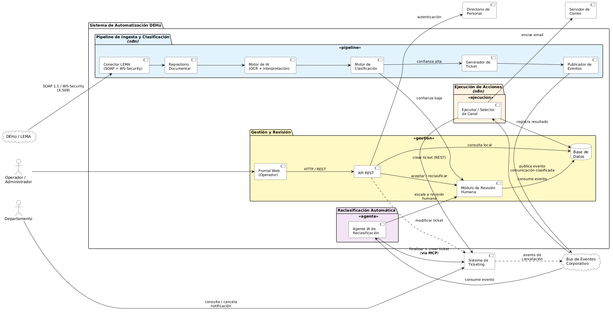
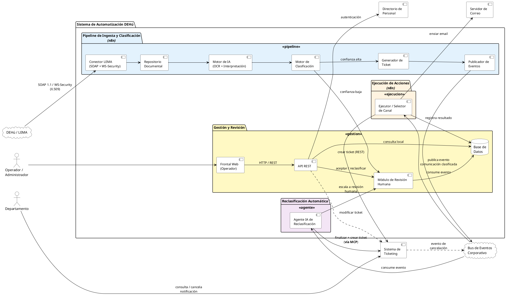

# Diagrama de arquitectura de componentes

*Vista de alto nivel del sistema completo (módulos y su comunicación), complementaria al [Diagrama de clases](Diagrama_Clases.md) — este diagrama muestra el "qué habla con qué" a nivel de sistema; el de clases muestra el detalle interno en capas `modelo`/`aplicacion`/`infraestructura`/`api`.*

---

## Diagrama

*Nota: la imagen debe estar en `img/diagrama_componentes.png`, relativa a este `.md` — si mueves el `.md`, mueve también la carpeta `img/`.*

---

**Nota sobre el propio diagrama**: no incluye numeración RF-XX ni anotaciones de proceso (justificaciones de por qué se decidió tal o cual cosa) — solo componentes, protocolos y el flujo real de dependencias, para que la imagen sea usable directamente en la memoria sin edición posterior. La trazabilidad a requisitos y el razonamiento de diseño quedan documentados en esta página, no en la imagen.

## Criterio de agrupación

Los componentes se agrupan en cuatro bloques, cada uno correspondiente a un tramo de requisitos funcionales, siguiendo la misma frontera que ya separa el `Especificacion_Requisitos.md` (sección 1: "generar el evento" vs. "ejecutar la acción") y el `Estado_del_proyecto.md` (sección 6, decisión de capas/patrones):

- **Pipeline de Ingesta y Clasificación (RF-01–RF-07)**: sondeo LEMA, almacenamiento documental, OCR/interpretación, clasificación, generación del contenido del ticket y publicación del evento.
- **Ejecución de Acciones (RF-08)**: un único componente (Ejecutor/Selector de Canal) que consume el evento y decide el canal de salida (ticket o email) por configuración, no por código específico (RF-08.4).

Ambos bloques se marcan como orquestados por **n8n**, siguiendo la tabla de componentes internos de `Especificacion_Requisitos.md` (sección 2.2): *"Orquestador (n8n u equivalente): coordina el flujo completo (RF-01 a RF-08) y publica/consume eventos"* — n8n no se limita al pipeline de ingesta, también implementa el enrutado/ejecución de la acción resultante.
- **Reclasificación Automática (RF-10)**: el Agente IA, aislado en su propio bloque porque su alcance de invocación MCP está deliberadamente acotado a una sola acción (finalizar+crear ticket) — no es un agente de propósito general.
- **Gestión y Revisión (RF-09, RF-11)**: el frontal del Operador, la API REST y el módulo de revisión humana, apoyados en la Base de Datos compartida.

## Decisiones de arquitectura reflejadas en el diagrama

- **Desacople Pipeline ↔ Ejecución vía el Bus de Eventos Corporativo.** Es la decisión de escalabilidad marcada como principio de diseño (no solo objetivo) en los RNF: permite añadir un canal de salida nuevo, o una fuente de entrada distinta de DEHú, sin tocar RF-01–RF-07. Por eso `Publicador de Eventos` y `Ejecutor de Acciones` no se conectan directamente entre sí en el diagrama.
- **`n8n` y el `Bus de Eventos Corporativo` se dibujan como dos elementos separados, deliberadamente.** `Especificacion_Requisitos.md` (nota de diseño de RF-07) los menciona juntos como una única infraestructura ya existente ("n8n + ecosistema de eventos corporativo"), pero `TODO.md` deja anotado, sin resolver, si Ticketing publica el evento de cancelación (RF-10.1) a través del propio n8n o de un bus corporativo distinto y suscribible por separado. Mientras no se confirme con el equipo de Infraestructura/Ticketing, se representa el bus como la infraestructura de mensajería (por eso es una nube, igual que DEHú/LEMA) y n8n como el motor que publica y consume contra ella — es la lectura que menos presupone.
- **El Agente IA de Reclasificación (RF-10) escucha el mismo bus**, no una llamada directa de Ticketing — reutiliza el patrón de evento ya definido en RF-07, tal como indica la nota de diseño de RF-10.1.
- **El MCP se representa como una única flecha etiquetada** ("finalizar + crear ticket vía MCP") en lugar de como un componente de integración genérico, para dejar visualmente claro que el alcance del MVP es esa acción concreta, no una capa de invocación de acciones arbitraria (ver sección 1 y RF-10, nota técnica).
- **Convención de línea discontinua vs. continua.** El diagrama usa la línea discontinua (`..>`) exclusivamente para una dependencia que el diseño da por hecha pero que todavía no está confirmada del lado externo (falta una API, falta identificar un proceso). No se usa para bifurcaciones condicionales del propio flujo (p. ej. "confianza baja" o "escala a revisión humana"), que son continuas porque son un comportamiento ya cerrado del diseño, simplemente condicional. Solo hay dos flechas discontinuas en todo el diagrama, y son las dos siguientes.
- **La modificación de tickets desde la API REST (RF-11.4/RF-11.5)** se dibuja con flecha discontinua hacia `Sistema de Ticketing` — la línea discontinua marca que esta dependencia está aún condicionada a que exista la API "audiencia back" de Ticketing (ver `Especificacion_Requisitos.md`, sección 6, tabla de riesgos), a diferencia del resto de integraciones ya cerradas.
- **El evento de cancelación (`Sistema de Ticketing` → `Bus de Eventos Corporativo`, RF-10.1) también se dibuja discontinuo, por el mismo motivo.** Un análisis del sistema de Ticketing confirmó que no realiza ninguna notificación de red directa (ni webhook ni cola de mensajes) ante un cambio de estado de ticket — el mecanismo real es interno a Ticketing. Que ese cambio interno llegue finalmente al bus de eventos corporativo depende de una pieza intermedia aún no identificada, ajena a Ticketing. La línea discontinua es intencionadamente la misma que la de "modificar ticket": ambas representan integraciones que forman parte del diseño pero no están confirmadas al 100%.
- **Autenticación contra el Directorio de Personal** aparece como dependencia de la API REST, reflejando el RNF de control de acceso (roles `operador`/`administrador`).
- **Base de Datos como componente único compartido** entre Pipeline, Ejecución y Gestión — coherente con el ER ya cerrado (`ER_Explicacion.md`) y con la ausencia deliberada de una tabla de eventos propia (la trazabilidad la cubren `CLASIFICACION` y `DERIVACION`).
- **Nota de maquetación**: `nodesep 60` (frente a los 30 iniciales) no es arbitrario — sin él, PlantUML/Graphviz aprieta demasiado las etiquetas de los paquetes contiguos (`Ejecución de Acciones`, `Gestión y Revisión`) y el trazo de alguna flecha acaba atravesando el texto por la mitad. Si se vuelve a tocar el layout, revisar primero si las etiquetas siguen legibles antes de simplificar el `skinparam`.

## Correspondencia RF → componente

| Componente | RF cubiertos |
|---|---|
| Conector LEMA | RF-01 |
| Repositorio Documental | RF-02 |
| Motor de IA (OCR + Interpretación) | RF-03, RF-04 |
| Motor de Clasificación | RF-05 |
| Generador de Ticket | RF-06 |
| Publicador de Eventos | RF-07 |
| Ejecutor / Selector de Canal | RF-08 |
| Módulo de Revisión Humana | RF-09 |
| Agente IA de Reclasificación | RF-10 |
| API REST + Frontal Web | RF-11, RNF control de acceso |

## Código PlantUML

## Pendiente

- Confirmar con el equipo de Ticketing si el `Ejecutor / Selector de Canal` puede invocar la creación de tickets de forma síncrona desde el consumo del evento, o si conviene una cola intermedia adicional por resiliencia (RNF de resiliencia ante caídas de Ticketing).
- Cuando se cierre la API "audiencia back", pasar la flecha `API ..> Ticketing` de discontinua a continua y documentar el contrato real.
- Valorar si el Motor de IA (OCR + Interpretación) debe representarse como dos componentes separados si en el desarrollo se confirma que se externalizan como módulo de agentes IA independiente (mencionado como decisión de arquitectura pendiente en `Especificacion_Requisitos.md`, sección 2.2).