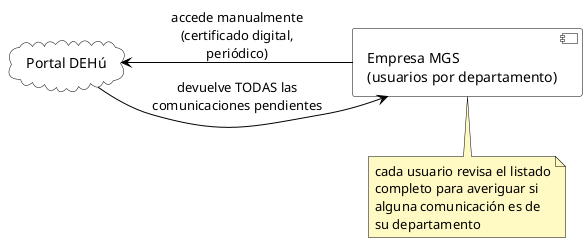
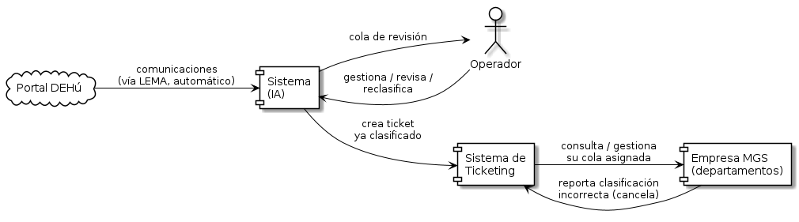
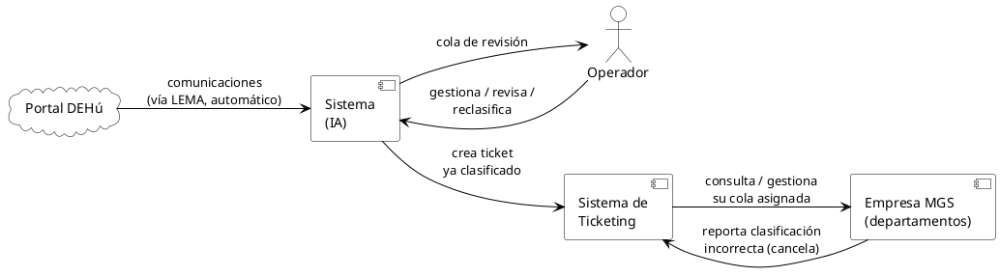

# Diagrama de contexto (alto nivel)

*Vista de contexto del sistema: qué entidades rodean la plataforma y qué intercambian con ella, sin entrar en componentes internos (para el detalle interno, ver [Diagrama de componentes](Diagrama_Componentes.md)). Se muestran dos situaciones: la actual (acceso manual) y la futura (con el sistema automatizado + IA).*

`Propuesta de proyecto.md` describe la situación actual de forma genérica ("buzones y sedes electrónicas de organismos públicos"). La puerta concreta es la **sede web de DEHú** (Dirección Electrónica Habilitada única). **Mi Carpeta Ciudadana** es otro portal (ciudadano); no es la que usan las áreas para este proceso. LEMA es la misma DEHú por servicios web, para Grandes Destinatarios (ver `Estado_del_proyecto.md`, sección 1).

**Objetivo concreto**: sustituir el acceso manual y periódico de cada departamento a la sede web de DEHú por LEMA, clasificar cada comunicación (metadatos primero; OCR/LLM si hace falta) y derivarla al departamento vía ticket, sin que nadie recorra el listado completo.

---

## Situación actual

Resumen (detalle completo en `Propuesta de proyecto.md`, sección "Descripción general"): sin sistema intermedio, usuarios de la Empresa MGS acceden manualmente y de forma periódica, revisan todas las comunicaciones pendientes y determinan una por una cuáles son de su departamento — el propio usuario hace de "filtro".

---

## Situación futura (con Sistema + IA)

El sistema se interpone entre DEHú y la Empresa MGS: consulta las comunicaciones automáticamente (vía LEMA), las clasifica y deriva a cada departamento solo lo que le corresponde, creando un ticket en el Sistema de Ticketing (canal principal, ver `Estado_del_proyecto.md` sección 3). El Operador gestiona la cola de revisión humana para los casos de baja confianza.

### Elementos

- **DEHú**: fuente de las comunicaciones (sede web hoy; LEMA en la situación futura). Mi Carpeta Ciudadana no aparece: es otro portal.
- **Sistema (IA)**: la plataforma de automatización objeto del TFM — ingesta, clasificación (metadatos; OCR si hace falta) y generación de tickets/notificaciones.
- **Sistema de Ticketing**: sistema interno ya existente en MGS (fuera del alcance del TFM) donde el Sistema (IA) crea el ticket derivado; es el canal por el que la Empresa MGS consulta y gestiona sus comunicaciones asignadas (ver `Diagrama_Componentes.md`).
- **Empresa MGS**: los departamentos internos que reciben ya filtrada y clasificada solo la comunicación que les corresponde (a diferencia de la situación actual, ya no revisan el listado completo).
- **Operador**: rol interno que gestiona la cola de revisión humana y la reclasificación manual (ver `Diagrama_Componentes.md`, bloque "Gestión y Revisión").

