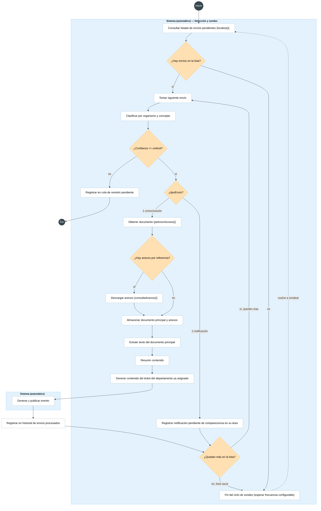
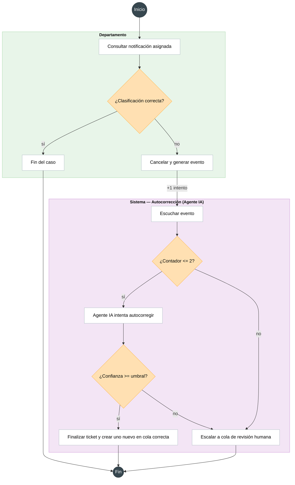
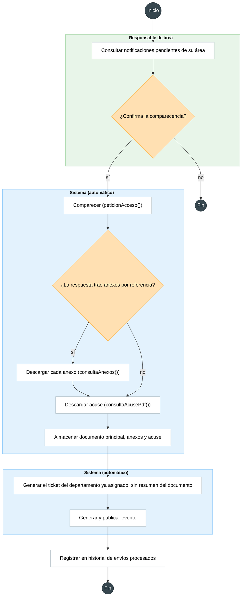
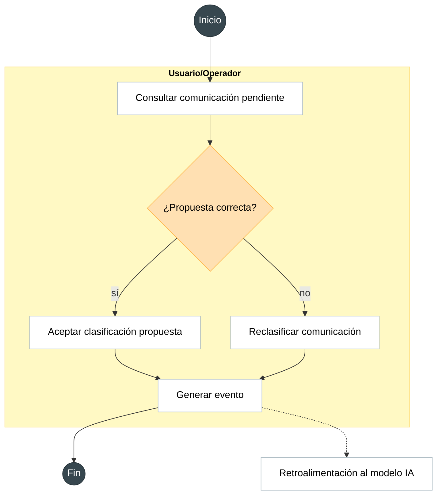
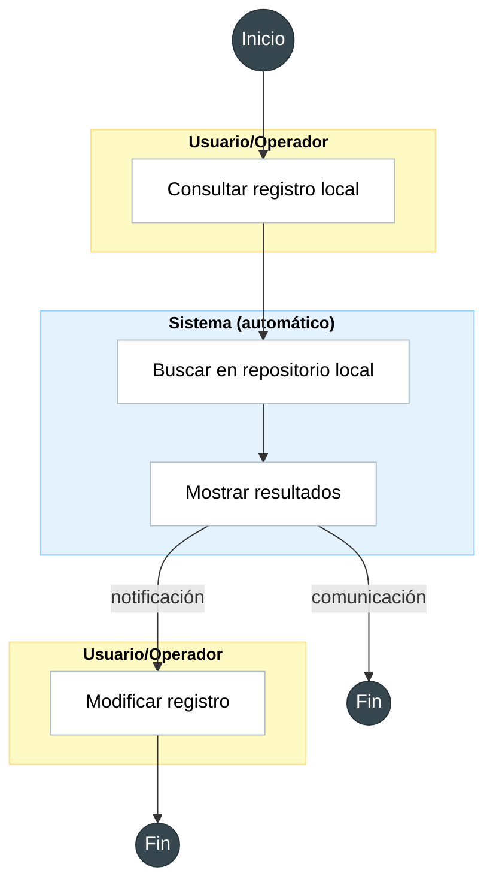
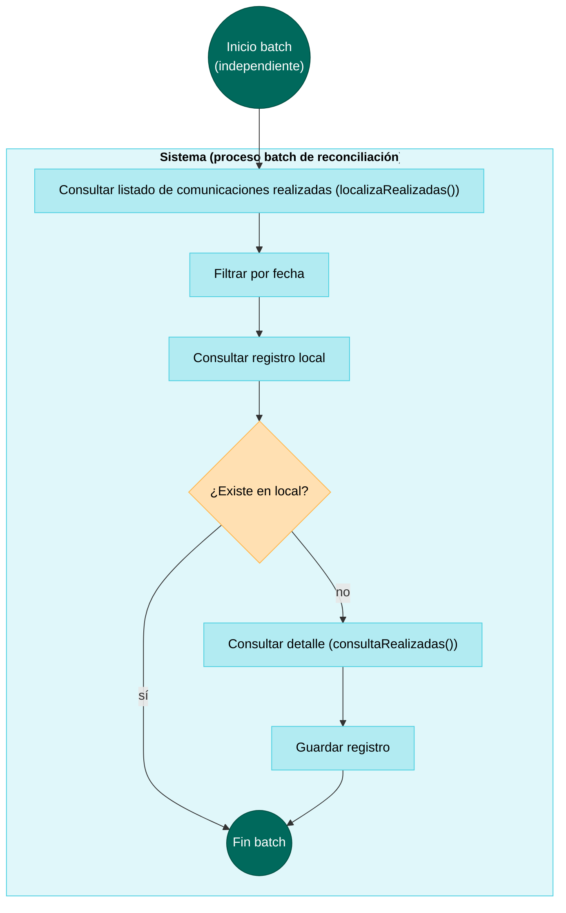

# Diagramas de flujo — Automatización DEHú (MGS)

Seis flujos independientes (cada uno con su propio inicio/fin, sin referencias cruzadas entre ellos). Código Mermaid listo para pegar en [Mermaid Live Editor](https://mermaid.live) o renderizar directamente.

---

## 1. Sistema (automático) — Detección, sondeo y clasificación

Sondeo periódico de `localiza()`. Los dos tipos se clasifican antes de abrir el documento, con organismo emisor y concepto. Si la confianza no basta, van a revisión y no se abre. **Comunicación (`1`)**, ya clasificada: `peticionAcceso()` en el mismo ciclo, anexos solo si la respuesta trae `anexosReferencia`, sin `consultaAcusePdf()`. Se extrae y resume el documento principal y se genera el ticket del departamento ya asignado. No se clasifica otra vez. **Notificación (`2`)**: queda pendiente de comparecencia para esa área. No hay `peticionAcceso()`, anexo, acuse, resumen ni ticket.

---

## 2. Departamento + Autocorrección (Agente IA)

El Departamento consulta la notificación asignada; si la clasificación está mal, cancela (lo que genera un evento e incrementa un contador de intentos persistente). El Agente IA escucha ese evento directamente — comprueba el contador *antes* de intentar reclasificar; si ya alcanzó el límite (2), escala sin gastar otro intento.

---

## 3. Responsable de área — Comparecencia de una notificación

El responsable consulta en el frontal las notificaciones de su área que siguen pendientes. Ya están clasificadas: el departamento salió de organismo y concepto en el sondeo, y aquí no se clasifica otra vez. La lista muestra organismo, concepto, titular, `fechaPuestaDisposicion` y el día 10 calculado desde esa fecha. Confirmar es la comparecencia: `peticionAcceso()` practica la notificación y el plazo de respuesta del documento empieza al día siguiente. Los anexos por referencia se piden solo si la respuesta trae `referenciaDocumento`. El acuse se descarga en el mismo ciclo. No se extrae ni se resume el documento: el resumen solo se hace si la descarga es inmediata, y en la notificación no lo es hasta que lo confirmen el resto de departamentos. Se genera el ticket del departamento ya asignado, sin ese resumen. El vencimiento del correo de aviso no entra: `localiza()` no lo devuelve.

---

## 4. Usuario/Operador

Gestión manual de comunicaciones de baja confianza: aceptar la propuesta de la IA o reclasificar. Ambas rutas generan un evento que, en paralelo (sin bloquear el cierre del caso), retroalimenta al modelo IA.

---

## 5. Consulta local (Operador)

Consulta bajo demanda de registros ya guardados, sin invocar a DEHú. Las comunicaciones son de solo lectura; las notificaciones (tickets) permiten modificación.

---

## 6. Reconciliación periódica *(condicionado a tiempo disponible)*

Proceso batch independiente que compara `localizaRealizadas()` contra el repositorio local, para detectar posibles fallos silenciosos del flujo principal. No forma parte del alcance comprometido del MVP.

