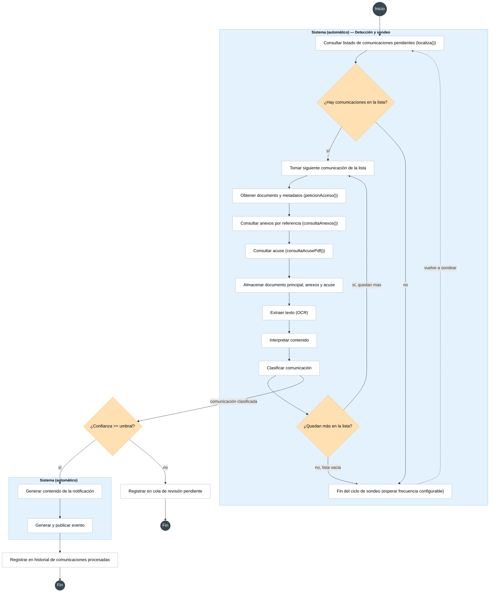
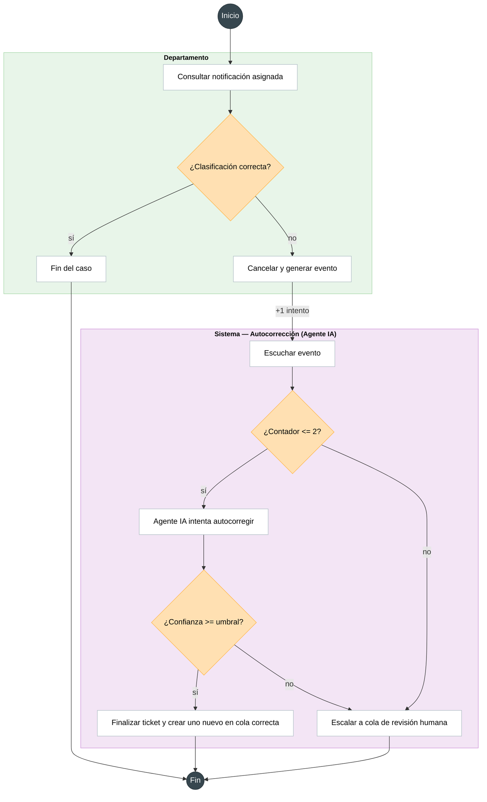
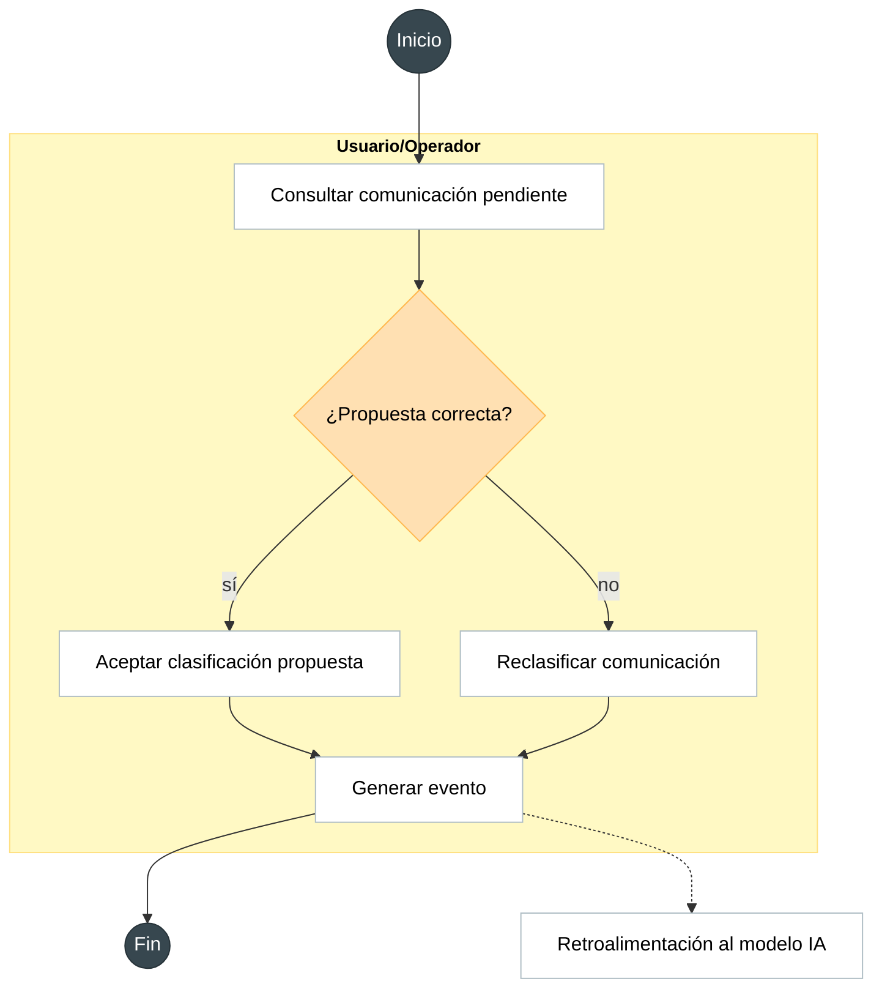
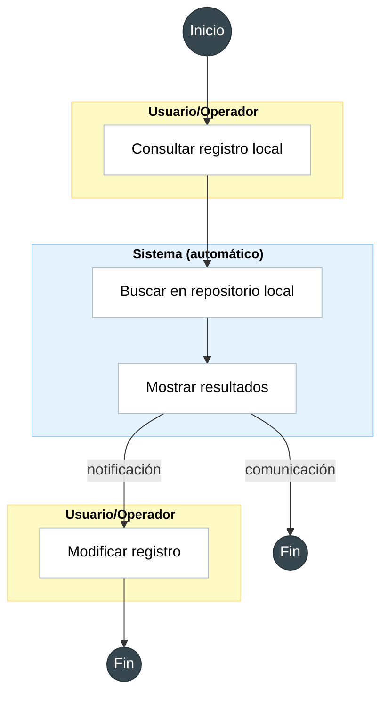
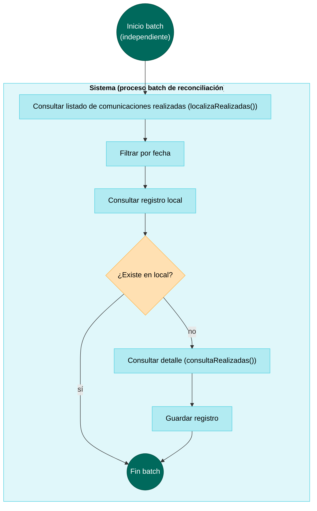

# Diagramas de flujo — Automatización DEHú (MGS)

Cinco flujos independientes (cada uno con su propio inicio/fin, sin referencias cruzadas entre ellos). Código Mermaid listo para pegar en [Mermaid Live Editor](https://mermaid.live) o renderizar directamente.

---

## 1. Sistema (automático) — Detección, sondeo y clasificación

Sondeo periódico de `localiza()`, iteración sobre la lista, obtención de documento/anexos/acuse, OCR, interpretación y clasificación. Termina registrando la comunicación (cola de revisión pendiente si confianza baja; historial de procesadas si confianza alta).

---

## 2. Departamento + Autocorrección (Agente IA)

El Departamento consulta la notificación asignada; si la clasificación está mal, cancela (lo que genera un evento e incrementa un contador de intentos persistente). El Agente IA escucha ese evento directamente — comprueba el contador *antes* de intentar reclasificar; si ya alcanzó el límite (2), escala sin gastar otro intento.

---

## 3. Usuario/Operador

Gestión manual de comunicaciones de baja confianza: aceptar la propuesta de la IA o reclasificar. Ambas rutas generan un evento que, en paralelo (sin bloquear el cierre del caso), retroalimenta al modelo IA.

---

## 4. Consulta local (Operador)

Consulta bajo demanda de registros ya guardados, sin invocar a DEHú. Las comunicaciones son de solo lectura; las notificaciones (tickets) permiten modificación.

---

## 5. Reconciliación periódica *(condicionado a tiempo disponible)*

Proceso batch independiente que compara `localizaRealizadas()` contra el repositorio local, para detectar posibles fallos silenciosos del flujo principal. No forma parte del alcance comprometido del MVP.

