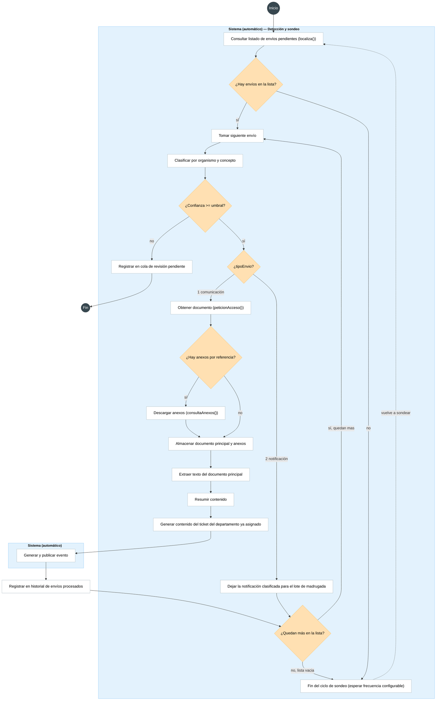
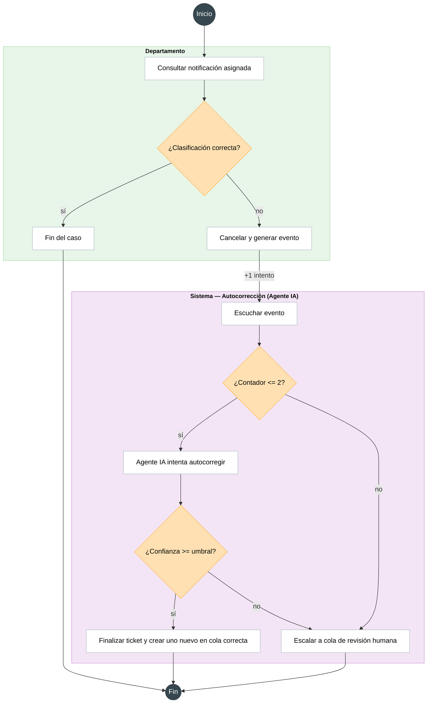
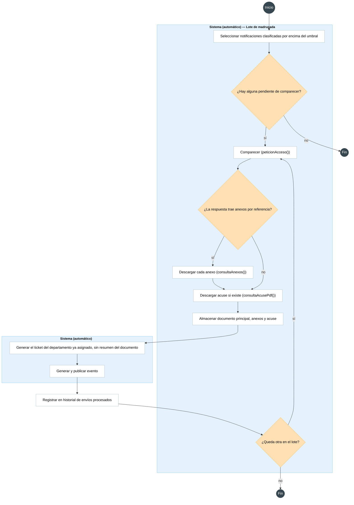
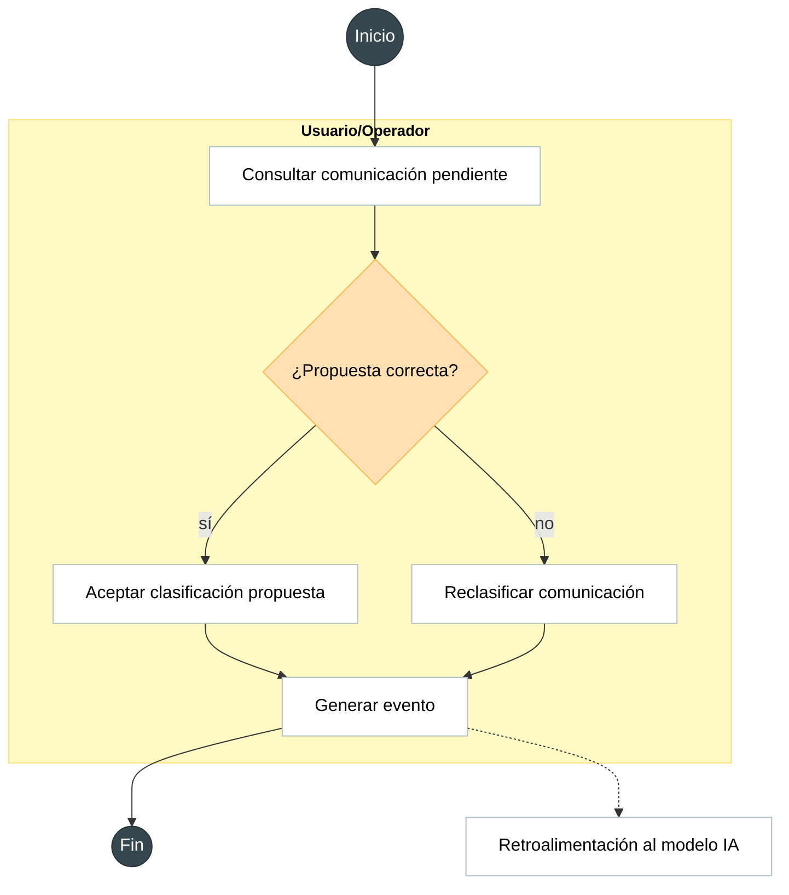
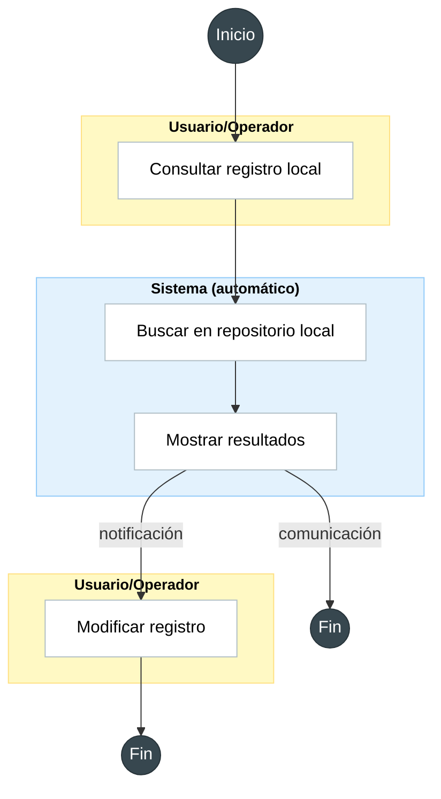
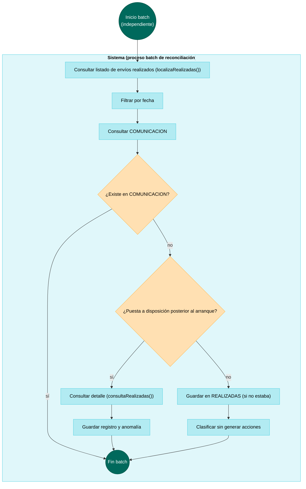

# Diagramas de flujo — Automatización DEHú (MGS)

Seis flujos independientes (cada uno con su propio inicio/fin, sin referencias cruzadas entre ellos). Código Mermaid listo para pegar en [Mermaid Live Editor](https://mermaid.live) o renderizar directamente.

---

## 1. Sistema (automático) — Detección, sondeo y clasificación

Sondeo periódico de `localiza()`. Los dos tipos se clasifican antes de abrir el documento. La señal base es organismo emisor y concepto. Si la confianza no basta, van a revisión y no se abre. **Comunicación (`1`)**, ya clasificada: `peticionAcceso()` en el mismo ciclo, anexos solo si la respuesta trae `anexosReferencia`, sin `consultaAcusePdf()`. Se extrae y resume el documento principal y se genera el ticket del departamento ya asignado. No se clasifica otra vez. **Notificación (`2`)** por encima del umbral: queda clasificada para el lote de madrugada. En el sondeo no hay `peticionAcceso()`, anexo, acuse, resumen ni ticket.

```mermaid
%%{init: {"flowchart": {"wrappingWidth": 600}}}%%
flowchart TD
    start(("Inicio")) --> a1

    subgraph SIS1["Sistema (automático) — Detección y sondeo"]
        direction TB
        a1["Consultar listado de envíos pendientes (localiza())"]
        decHasItems{"¿Hay envíos en la lista?"}
        loopNext["Tomar siguiente envío"]
        aClasif["Clasificar por organismo y concepto"]
        decN{"¿Confianza >= umbral?"}
        decTipo{"¿tipoEnvio?"}
        a2["Obtener documento (peticionAcceso())"]
        decAnexos{"¿Hay anexos por referencia?"}
        aAnexos["Descargar anexos (consultaAnexos())"]
        a3["Almacenar documento principal y anexos"]
        a4["Extraer texto del documento principal"]
        a5["Resumir contenido"]
        aNotif["Dejar la notificación clasificada para el lote de madrugada"]
        decLoop{"¿Quedan más en la lista?"}
        pollWait["Fin del ciclo de sondeo (esperar frecuencia configurable)"]

        a1 --> decHasItems
        decHasItems -->|sí| loopNext --> aClasif --> decN
        decN -->|no| pendReview["Registrar en cola de revisión pendiente"]
        decN -->|sí| decTipo
        decTipo -->|1 comunicación| a2 --> decAnexos
        decAnexos -->|sí| aAnexos --> a3
        decAnexos -->|no| a3
        a3 --> a4 --> a5 --> b1
        decTipo -->|2 notificación| aNotif --> decLoop
        decHasItems -->|no| pollWait
        decLoop -->|sí, quedan mas| loopNext
        decLoop -->|no, lista vacia| pollWait
        pollWait -.->|vuelve a sondear| a1
    end

    pendReview --> stop2(("Fin"))

    subgraph SIS2["Sistema (automático)"]
        direction TB
        b1["Generar contenido del ticket del departamento ya asignado"]
        b2["Generar y publicar evento"]
        b1 --> b2
    end

    b2 --> procReg["Registrar en historial de envíos procesados"] --> decLoop

    style SIS1 fill:#E3F2FD,stroke:#90CAF9,color:#000000,font-weight:bold,font-size:14px
    style SIS2 fill:#E3F2FD,stroke:#90CAF9,color:#000000,font-weight:bold,font-size:14px

    classDef process fill:#FFFFFF,stroke:#B0BEC5,color:#000000;
    classDef decision fill:#FFE0B2,stroke:#FFB74D,color:#000000;
    classDef terminal fill:#37474F,stroke:#263238,color:#ffffff;

    class a1,a2,aAnexos,a3,a4,a5,aClasif,aNotif,loopNext,pollWait,b1,b2,pendReview,procReg process
    class decN,decHasItems,decTipo,decAnexos,decLoop decision
    class start,stop2 terminal
```

---

## 2. Departamento + Autocorrección (Agente IA)

El Departamento consulta la notificación asignada; si la clasificación está mal, cancela (lo que genera un evento e incrementa un contador de intentos persistente). El Agente IA escucha ese evento directamente — comprueba el contador *antes* de intentar reclasificar; si ya alcanzó el límite (2), escala sin gastar otro intento.

```mermaid
%%{init: {"flowchart": {"wrappingWidth": 600}}}%%
flowchart TD
    start(("Inicio")) --> d1

    subgraph DEP["Departamento"]
        direction TB
        d1["Consultar notificación asignada"]
        dec3{"¿Clasificación correcta?"}
        d2["Fin del caso"]
        d3["Cancelar y generar evento"]
        d1 --> dec3
        dec3 -->|sí| d2
        dec3 -->|no| d3
    end

    d2 --> stop(("Fin"))
    d3 -->|"+1 intento"| agentEvt

    subgraph AGENT["Sistema — Autocorrección (Agente IA)"]
        direction TB
        agentEvt["Escuchar evento"]
        decAttempts{"¿Contador <= 2?"}
        agentTry["Agente IA intenta autocorregir"]
        decConf{"¿Confianza >= umbral?"}
        agentSuccess["Finalizar ticket y crear uno nuevo en cola correcta"]
        agentEscalate["Escalar a cola de revisión humana"]

        agentEvt --> decAttempts
        decAttempts -->|sí| agentTry --> decConf
        decConf -->|sí| agentSuccess
        decConf -->|no| agentEscalate
        decAttempts -->|no| agentEscalate
    end

    agentSuccess --> stop
    agentEscalate --> stop

    style DEP fill:#E8F5E9,stroke:#A5D6A7,color:#000000,font-weight:bold,font-size:14px
    style AGENT fill:#F3E5F5,stroke:#CE93D8,color:#000000,font-weight:bold,font-size:14px

    classDef process fill:#FFFFFF,stroke:#B0BEC5,color:#000000;
    classDef decision fill:#FFE0B2,stroke:#FFB74D,color:#000000;
    classDef terminal fill:#37474F,stroke:#263238,color:#ffffff;

    class d1,d2,d3,agentEvt,agentTry,agentSuccess,agentEscalate process
    class dec3,decAttempts,decConf decision
    class start,stop terminal
```

---

## 3. Lote de madrugada — Comparecencia y derivación

Entran las notificaciones ya clasificadas por encima del umbral. No se clasifica otra vez. `peticionAcceso()` es la comparecencia y puede abrir el plazo de respuesta. Los anexos por referencia se piden solo si la respuesta trae `referenciaDocumento`. El acuse se descarga en el mismo ciclo cuando existe. No se extrae ni se resume el documento. Se genera el ticket del departamento ya asignado, sin ese resumen, y se deriva enseguida. Una notificación por debajo del umbral no entra.

```mermaid
%%{init: {"flowchart": {"wrappingWidth": 600}}}%%
flowchart TD
    start(("Inicio")) --> n0

    subgraph SIS["Sistema (automático) — Lote de madrugada"]
        direction TB
        n0["Seleccionar notificaciones clasificadas por encima del umbral"]
        decHay{"¿Hay alguna pendiente de comparecer?"}
        n2["Comparecer (peticionAcceso())"]
        decAnexos{"¿La respuesta trae anexos por referencia?"}
        nAnexos["Descargar cada anexo (consultaAnexos())"]
        nAcuse["Descargar acuse si existe (consultaAcusePdf())"]
        n3["Almacenar documento principal, anexos y acuse"]
        decMas{"¿Queda otra en el lote?"}

        n0 --> decHay
        decHay -->|sí| n2 --> decAnexos
        decAnexos -->|sí| nAnexos --> nAcuse
        decAnexos -->|no| nAcuse
        nAcuse --> n3
    end

    decHay -->|no| stopNo(("Fin"))
    n3 --> b1

    subgraph SIS2["Sistema (automático)"]
        direction TB
        b1["Generar el ticket del departamento ya asignado, sin resumen del documento"]
        b2["Generar y publicar evento"]
        b1 --> b2
    end

    b2 --> procReg["Registrar en historial de envíos procesados"] --> decMas
    decMas -->|sí| n2
    decMas -->|no| stop1(("Fin"))

    style SIS fill:#E3F2FD,stroke:#90CAF9,color:#000000,font-weight:bold,font-size:14px
    style SIS2 fill:#E3F2FD,stroke:#90CAF9,color:#000000,font-weight:bold,font-size:14px

    classDef process fill:#FFFFFF,stroke:#B0BEC5,color:#000000;
    classDef decision fill:#FFE0B2,stroke:#FFB74D,color:#000000;
    classDef terminal fill:#37474F,stroke:#263238,color:#ffffff;

    class n0,n2,nAnexos,nAcuse,n3,b1,b2,procReg process
    class decHay,decAnexos,decMas decision
    class start,stopNo,stop1 terminal
```

---

## 4. Usuario/Operador

Gestión manual de envíos de baja confianza: aceptar la propuesta o reclasificar el departamento, con los metadatos de `localiza()` y sin abrir el documento. Aceptar una notificación no la comparece: queda para el lote de madrugada. Ambas rutas generan un evento que, en paralelo (sin bloquear el cierre del caso), retroalimenta al modelo IA.

```mermaid
%%{init: {"flowchart": {"wrappingWidth": 600}}}%%
flowchart TD
    start(("Inicio")) --> c1

    subgraph OP["Usuario/Operador"]
        direction TB
        c1["Consultar comunicación pendiente"]
        dec2{"¿Propuesta correcta?"}
        c2["Aceptar clasificación propuesta"]
        c4["Reclasificar comunicación"]
        c3["Generar evento"]
        c1 --> dec2
        dec2 -->|sí| c2 --> c3
        dec2 -->|no| c4 --> c3
    end

    c3 --> stop(("Fin"))
    c3 -.-> fb["Retroalimentación al modelo IA"]

    style OP fill:#FFF9C4,stroke:#FFE082,color:#000000,font-weight:bold,font-size:14px

    classDef process fill:#FFFFFF,stroke:#B0BEC5,color:#000000;
    classDef decision fill:#FFE0B2,stroke:#FFB74D,color:#000000;
    classDef terminal fill:#37474F,stroke:#263238,color:#ffffff;

    class c1,c2,c4,c3,fb process
    class dec2 decision
    class start,stop terminal
```

---

## 5. Consulta local (Operador)

Consulta bajo demanda de registros ya guardados, sin invocar a DEHú. Las comunicaciones son de solo lectura; las notificaciones (tickets) permiten modificación.

```mermaid
%%{init: {"flowchart": {"wrappingWidth": 600}}}%%
flowchart TD
    ostart(("Inicio")) --> o1

    subgraph OPCONSULTA["Usuario/Operador"]
        direction TB
        o1["Consultar registro local"]
    end

    o1 --> o2

    subgraph SISCONSULTA["Sistema (automático)"]
        direction TB
        o2["Buscar en repositorio local"]
        o3["Mostrar resultados"]
        o2 --> o3
    end

    o3 -->|comunicación| stop1(("Fin"))
    o3 -->|notificación| o4

    subgraph OPMOD["Usuario/Operador"]
        direction TB
        o4["Modificar registro"]
    end

    o4 --> stop2(("Fin"))

    style OPCONSULTA fill:#FFF9C4,stroke:#FFE082,color:#000000,font-weight:bold,font-size:14px
    style SISCONSULTA fill:#E3F2FD,stroke:#90CAF9,color:#000000,font-weight:bold,font-size:14px
    style OPMOD fill:#FFF9C4,stroke:#FFE082,color:#000000,font-weight:bold,font-size:14px

    classDef process fill:#FFFFFF,stroke:#B0BEC5,color:#000000;
    classDef decision fill:#FFE0B2,stroke:#FFB74D,color:#000000;
    classDef terminal fill:#37474F,stroke:#263238,color:#ffffff;

    class o1,o2,o3,o4 process
    class ostart,stop1,stop2 terminal
```

---

## 6. Reconciliación periódica *(condicionado a tiempo disponible)*

Proceso batch independiente que compara `localizaRealizadas()` contra el repositorio local. Un envío posterior al arranque que no está en `COMUNICACION` es una anomalía: un fallo silencioso del flujo principal o un acceso manual al portal. Uno anterior al arranque se guarda en `REALIZADAS` para evaluar la clasificación, sin generar ninguna acción (RF-12.4–12.6). No forma parte del alcance comprometido del MVP.

```mermaid
%%{init: {"flowchart": {"wrappingWidth": 600}}}%%
flowchart TD
    rstart(("Inicio batch<br>(independiente)")) --> r1

    subgraph BATCH["Sistema (proceso batch de reconciliación)"]
        direction TB
        r1["Consultar listado de envíos realizados (localizaRealizadas())"]
        r2["Filtrar por fecha"]
        r3["Consultar COMUNICACION"]
        decR1{"¿Existe en COMUNICACION?"}
        decR2{"¿Puesta a disposición posterior al arranque?"}
        r4["Consultar detalle (consultaRealizadas())"]
        r5["Guardar registro y anomalía"]
        r6["Guardar en REALIZADAS (si no estaba)"]
        r7["Clasificar sin generar acciones"]

        r1 --> r2 --> r3 --> decR1
        decR1 -->|sí| rstop
        decR1 -->|no| decR2
        decR2 -->|sí| r4 --> r5 --> rstop
        decR2 -->|no| r6 --> r7 --> rstop
    end

    rstop(("Fin batch"))

    style BATCH fill:#E0F7FA,stroke:#4DD0E1,color:#000000,font-weight:bold,font-size:15px

    classDef processBatch fill:#B2EBF2,stroke:#4DD0E1,color:#000000;
    classDef decision fill:#FFE0B2,stroke:#FFB74D,color:#000000;
    classDef terminalBatch fill:#00695C,stroke:#004D40,color:#ffffff;

    class r1,r2,r3,r4,r5,r6,r7 processBatch
    class decR1,decR2 decision
    class rstart,rstop terminalBatch
```