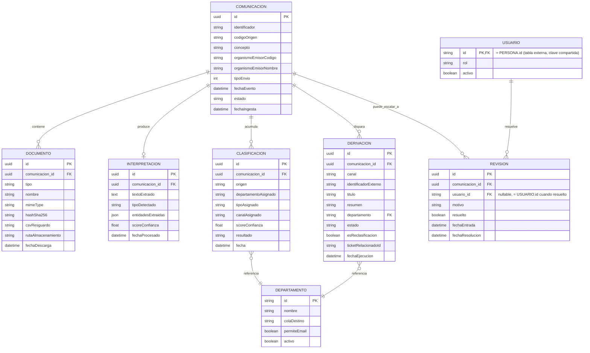

# Explicación del ER — Automatización DEHú (MGS)

*Este documento explica qué representa cada tabla y cómo se relacionan entre sí.*

---

## Diagrama completo



---

## Entidad central: `COMUNICACION`

Cada fila representa **un envío recibido de DEHú** (notificación o comunicación, según el sentido oficial de DEHú, distinguido por `tipoEnvio`). Todo lo demás del modelo cuelga de aquí.

| Campo | Origen | Nota |
|---|---|---|
| `identificador`, `codigoOrigen` | `localiza()` | Identificadores propios de DEHú; se usan para deduplicar (RF-01.3) y para encadenar las siguientes llamadas a LEMA |
| `concepto`, `organismoEmisorCodigo`, `organismoEmisorNombre` | `localiza()` | Solo existen en `localiza()`, no en `peticionAcceso()` — hay que capturarlos en el primer paso del flujo (detección), no esperar a la descarga del documento |
| `tipoEnvio` | `localiza()` | Distingue notificación/comunicación según DEHú |
| `estado` | Interno | Ciclo de vida propio del sistema: `pendiente → en_proceso → en_revision / procesada` — no es un estado de DEHú |
| `fechaEvento`, `fechaIngesta` | Mixto | `fechaEvento` viene de DEHú; `fechaIngesta` es el timestamp interno de cuándo se procesó |

---

## Resumen completo de relaciones

```
COMUNICACION 1───N DOCUMENTO
COMUNICACION 1───1 INTERPRETACION    (opcional)
COMUNICACION 1───N CLASIFICACION
COMUNICACION 1───N DERIVACION
COMUNICACION 1───N REVISION          (opcional)
USUARIO      1───N REVISION
DEPARTAMENTO 1───N CLASIFICACION
DEPARTAMENTO 1───N DERIVACION
```

`(opcional)` marca las relaciones donde no toda `COMUNICACION` tiene necesariamente una fila asociada — `INTERPRETACION` solo existe tras el procesamiento IA; `REVISION` solo existe si la comunicación escaló a revisión humana, y puede tener más de una fila si la comunicación escala a revisión en más de una ocasión (p. ej. una reclasificación posterior vuelve a caer por debajo del umbral).

## Relaciones desde `COMUNICACION`

### `DOCUMENTO` (1:N)

Una comunicación puede tener varios documentos: el principal, cada anexo, y el acuse — todos en la misma tabla, distinguidos por `tipo`.

- `hashSha256` — verifica integridad (RF-02.4), comparando contra el hash que devuelve DEHú
- `csvResguardo` — código de justificante que devuelve `peticionAcceso()` junto al documento principal; hay que poder reenviarlo si algún día se necesita volver a pedir el acuse por esa vía (`consultaAcusePdf()` con tipo `csvResguardo`)

### `INTERPRETACION` (1:1 opcional)

Resultado de OCR + LLM (RF-03/RF-04): texto extraído, tipo detectado, entidades, score de confianza. Es opcional porque hasta que no se procesa, la comunicación no tiene interpretación todavía.

### `CLASIFICACION` (1:N)

Historial completo de decisiones de clasificación — no se sobrescribe, se acumula. Cada fila es un intento.

- `origen` — distingue quién hizo la clasificación: `ia_inicial`, `ia_reclasificacion`, `operador`
- `departamentoAsignado`, `tipoAsignado` — dos resultados independientes de la misma clasificación (a qué departamento va, y de qué tipo es la comunicación); RF-09.6 permite al Operador corregir uno, el otro, o ambos
- Esta tabla es el historial de auditoría, y también la fuente para derivar el contador de reintentos de RF-10.2 (contando filas con `origen = 'ia_reclasificacion'` para esa comunicación), sin necesidad de un campo contador aparte

### `DERIVACION` (1:N)

El resultado de RF-08: cada vez que se ejecuta una acción real hacia un departamento (crear ticket, enviar email, depositar en buzón), queda una fila aquí.

- `departamento` (FK) — a qué departamento se derivó
- `esReclasificacion` + `ticketRelacionadoId` — cubren el caso confirmado con el responsable de Ticketing: Ticketing no permite cambiar de cola, así que una reclasificación finaliza el ticket original y crea uno nuevo, enlazados por este campo nativo de la API

### `REVISION` (1:N opcional)

Solo existe si la comunicación quedó por debajo del umbral de confianza y escaló a cola humana (RF-09.1). Es 1:N y no 1:1 porque una misma comunicación puede escalar a revisión más de una vez a lo largo de su ciclo de vida — por ejemplo, si tras una reclasificación (RF-10) la nueva propuesta vuelve a caer por debajo del umbral. Cada escalada genera una fila nueva; las anteriores quedan cerradas (`resuelto = true`) como historial.

- `usuario_id` (FK, nullable) — quién resolvió esa revisión concreta; `null` mientras `resuelto = false`, se rellena junto con `fechaResolucion` cuando se resuelve
- Cubre tanto el caso de aceptar la propuesta de la IA (RF-09.5) como el de reclasificar manualmente (RF-09.6) — en ambos casos, quien tocó esta `REVISION` queda registrado aquí
- Para saber si una comunicación tiene una revisión pendiente *activa* en un momento dado, la consulta debe filtrar por `resuelto = false` en vez de asumir una única fila por comunicación

---

## Entidades de apoyo

### `DEPARTAMENTO`

Catálogo/diccionario, no cuelga directamente de `COMUNICACION` — se referencia desde `CLASIFICACION` y `DERIVACION` (ver resumen de relaciones al principio del documento).

| Campo | Para qué |
|---|---|
| `id`, `nombre` | Identidad del departamento |
| `colaDestino` | Cola de Ticketing asociada, cuando el canal es ticket |
| `permiteEmail` | Si el email está habilitado como canal (normal o de contingencia) para este departamento — RF-08.2 |
| `activo` | Si el departamento sigue operativo |

### `USUARIO`

Gestiona el control de acceso al frontal propio (operador/administrador — RF-09, restricción de reclasificación a admin).

- `id` — clave compartida con `PERSONA` (tabla externa de la empresa, con todos los empleados): `USUARIO.id` es directamente el `id` de `PERSONA`, no un UUID propio. Así se evita duplicar nombre/email, que ya viven en `PERSONA`.
- `PERSONA` no se dibuja en el ER porque es una tabla externa, gestionada por otro sistema — solo se anota la referencia.
