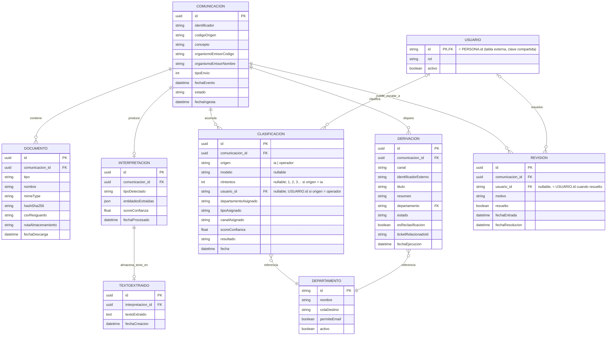

# Explicación del ER — Automatización DEHú (MGS)

*Este documento explica qué representa cada tabla y cómo se relacionan entre sí.*

---

## Diagrama completo



---

## Entidad central: `COMUNICACION`

Cada fila representa **un envío recibido de DEHú** (notificación o comunicación, según el sentido oficial de DEHú, distinguido por `tipoEnvio`). Todo lo demás del modelo cuelga de aquí.

| Campo | Origen | Nota |
|---|---|---|
| `identificador`, `codigoOrigen` | `localiza()` | Identificadores propios de DEHú; se usan para deduplicar (RF-01.3) y para encadenar las siguientes llamadas a LEMA |
| `concepto`, `organismoEmisorCodigo`, `organismoEmisorNombre` | `localiza()` | Solo existen en `localiza()`, no en `peticionAcceso()` — hay que capturarlos en el primer paso del flujo (detección), no esperar a la descarga del documento |
| `tipoEnvio` | `localiza()` | `1` comunicación, `2` notificación (plan de pruebas GD v2.0, §2.1.2–2.1.3) |
| `estado` | Interno | Ciclo de vida propio del sistema: `pendiente → en_proceso → en_revision / procesada` — no es un estado de DEHú |
| `fechaEvento`, `fechaIngesta` | Mixto | `fechaEvento` viene de DEHú; `fechaIngesta` es el timestamp interno de cuándo se procesó |

---

## Resumen completo de relaciones

```
COMUNICACION 1───N DOCUMENTO
COMUNICACION 1───1 INTERPRETACION    (opcional)
INTERPRETACION 1───1 TEXTOEXTRAIDO   (opcional)
COMUNICACION 1───N CLASIFICACION
COMUNICACION 1───N DERIVACION
COMUNICACION 1───N REVISION          (opcional)
USUARIO      0..1───N REVISION
USUARIO      0..1───N CLASIFICACION
DEPARTAMENTO 1───N CLASIFICACION
DEPARTAMENTO 1───N DERIVACION
```

`(opcional)` marca las relaciones donde no toda `COMUNICACION` tiene necesariamente una fila asociada — `INTERPRETACION` solo existe tras el procesamiento IA; `TEXTOEXTRAIDO` solo existe mientras no haya expirado su periodo de retención (ver más abajo); `REVISION` solo existe si la comunicación escaló a revisión humana, y puede tener más de una fila si la comunicación escala a revisión en más de una ocasión (p. ej. una reclasificación posterior vuelve a caer por debajo del umbral).

`0..1` en `USUARIO` significa que la fila puede no tener usuario. En `CLASIFICACION`, `usuario_id` va vacío si `origen = ia` y es obligatorio si `origen = operador`. En `REVISION`, va vacío mientras `resuelto = false` y se rellena al resolverla.

## Relaciones desde `COMUNICACION`

### `DOCUMENTO` (1:N)

Una comunicación puede tener varios documentos: el principal, cada anexo, y el acuse — todos en la misma tabla, distinguidos por `tipo`. Solo el documento principal pasa por el pipeline de IA (RF-03); anexos y acuse se archivan pero no se procesan (ver `INTERPRETACION`).

- `hashSha256` — verifica integridad (RF-02.4), comparando contra el hash que devuelve DEHú
- `csvResguardo` — código de justificante que devuelve `peticionAcceso()` junto al documento principal; hay que poder reenviarlo si algún día se necesita volver a pedir el acuse por esa vía (`consultaAcusePdf()` con tipo `csvResguardo`)

### `INTERPRETACION` (1:1 opcional)

Resultado de OCR + LLM sobre el **documento principal** (RF-03/RF-04): tipo detectado, entidades, score de confianza. Es opcional porque hasta que no se procesa, la comunicación no tiene interpretación todavía. El texto extraído en sí no vive aquí — ver `TEXTOEXTRAIDO`.

### `TEXTOEXTRAIDO` (1:1 opcional, desde `INTERPRETACION`)

Texto extraído del documento principal, separado de `INTERPRETACION` a propósito: es el campo más pesado y el menos consultado en el día a día (listados, dashboard), así que aislarlo evita penalizar esas consultas frecuentes. Se enlaza por `interpretacion_id` (no por `comunicacion_id` directamente) para mantener la jerarquía `COMUNICACION → INTERPRETACION → TEXTOEXTRAIDO` y no duplicar la relación con `COMUNICACION` en dos sitios.

Sujeto a una política de retención: se purga pasado un periodo definido por **parámetro global configurable** (no hardcodeado). El valor concreto se fijará tras contrastarlo con los compañeros.

### `CLASIFICACION` (1:N)

Historial completo de decisiones de clasificación — no se sobrescribe, se acumula. Cada fila es un intento.

- `origen` — `ia` u `operador`. No es el tipo de la comunicación (`tipoAsignado`)
- `modelo` — nombre del modelo si hubo LLM; vacío si la clasificación salió solo de metadatos o si `origen = operador`
- `nIntentos` — `1`, `2`, `3`… solo en filas `ia`. Vacío si `origen = operador`. La inicial es `1`; el tope de reclasificaciones (RF-10.2) cuenta filas `origen = ia` con `nIntentos > 1`, sin campo contador en `COMUNICACION`
- `usuario_id` (FK, nullable) — el operador de esa fila. Obligatorio si `origen = operador`; vacío si `origen = ia`. Varias clasificaciones de operadores distintos quedan en filas distintas, cada una con su id. No sustituye a `REVISION.usuario_id`, que es quién resolvió esa escalada
- `departamentoAsignado` (FK, obligatorio) — a qué departamento va la comunicación. Es la categorización del MVP: no hay catálogo de tipos. `tipoAsignado` queda en la tabla y no se rellena. RF-09.6 corrige el departamento. Toda fila tiene departamento.
- Esta tabla es el historial de auditoría: no se sobrescribe, se acumula

### `DERIVACION` (1:N)

El resultado de RF-08: cada vez que se ejecuta una acción real hacia un departamento (crear ticket, enviar email, depositar en buzón), queda una fila aquí.

- `departamento` (FK) — a qué departamento se derivó
- `esReclasificacion` + `ticketRelacionadoId` — cubren el caso confirmado con Dani: Ticketing no permite cambiar de cola, así que una reclasificación finaliza el ticket original y crea uno nuevo, enlazados por este campo nativo de la API

### `REVISION` (1:N opcional)

Solo existe si la comunicación quedó por debajo del umbral de confianza y escaló a cola humana (RF-09.1). Es 1:N y no 1:1 porque una misma comunicación puede escalar a revisión más de una vez a lo largo de su ciclo de vida — por ejemplo, si tras una reclasificación (RF-10) la nueva propuesta vuelve a caer por debajo del umbral. Cada escalada genera una fila nueva; las anteriores quedan cerradas (`resuelto = true`) como historial.

- `usuario_id` (FK, nullable) — quién resolvió esa revisión concreta; `null` mientras `resuelto = false`, se rellena junto con `fechaResolucion` cuando se resuelve
- Cubre tanto el caso de aceptar la propuesta de la IA (RF-09.5) como el de reclasificar manualmente (RF-09.6) — en ambos casos, quien tocó esta `REVISION` queda registrado aquí
- Para saber si una comunicación tiene una revisión pendiente *activa* en un momento dado, la consulta debe filtrar por `resuelto = false` en vez de asumir una única fila por comunicación

---

## Entidades de apoyo

### `DEPARTAMENTO`

Catálogo/diccionario, no cuelga directamente de `COMUNICACION` — se referencia desde `CLASIFICACION` y `DERIVACION` (ver resumen de relaciones al principio del documento).

| Campo | Para qué |
|---|---|
| `id`, `nombre` | Identidad del departamento |
| `colaDestino` | Cola de Ticketing asociada, cuando el canal es ticket |
| `permiteEmail` | Si el email está habilitado como canal (normal o de contingencia) para este departamento — RF-08.2 |
| `activo` | Si el departamento sigue operativo |

### `USUARIO`

Gestiona el control de acceso al frontal propio (operador/administrador — RF-09, restricción de reclasificación a admin).

- `id` — clave compartida con `PERSONA` (tabla externa de la empresa, con todos los empleados): `USUARIO.id` es directamente el `id` de `PERSONA`, no un UUID propio. Así se evita duplicar nombre/email, que ya viven en `PERSONA`.
- `PERSONA` no se dibuja en el ER porque es una tabla externa, gestionada por otro sistema — solo se anota la referencia.