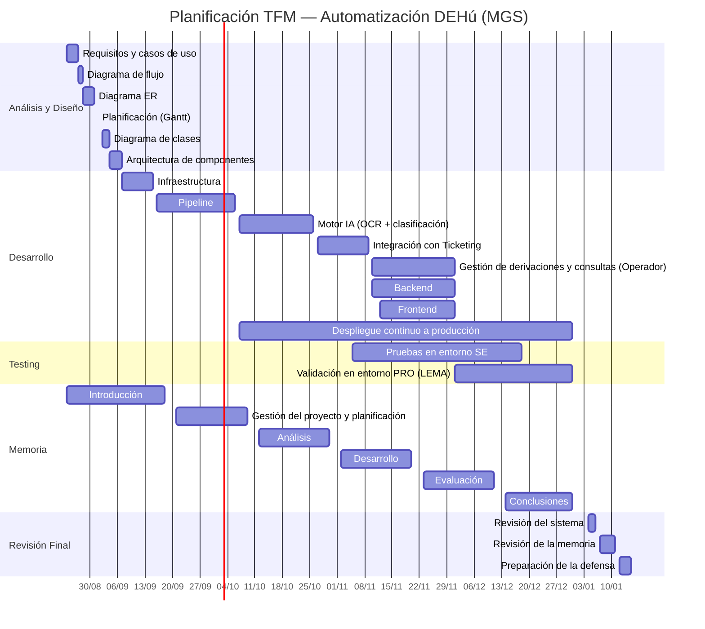

# Planificación

*Nota: el proyecto se gestiona también como archivo nativo `.gantt` en la herramienta online de Gantt (onlinegantt.com), que conserva la configuración de días laborables/festivos y la jerarquía de subtareas. Este documento (`Gantt.md`) es la versión para incluir en la memoria.*

### 1. Análisis y Diseño — 24/08/2026 a 07/09/2026
- Requisitos y casos de uso — 24/08/2026 a 27/08/2026
- Diagrama de flujo — 27/08/2026 a 28/08/2026
- Diagrama ER — 28/08/2026 a 31/08/2026
- Planificación (Gantt) — 01/09/2026
- Diagrama de clases — 02/09/2026 a 04/09/2026
- Arquitectura de componentes — 04/09/2026 a 07/09/2026

### 2. Desarrollo — 07/09/2026 a 31/12/2026
- Infraestructura — 07/09/2026 a 15/09/2026
- Pipeline — 16/09/2026 a 06/10/2026
- Motor IA (OCR + clasificación) — 07/10/2026 a 26/10/2026
- Integración con Ticketing — 27/10/2026 a 09/11/2026
- Gestión de derivaciones y consultas (Operador) — 10/11/2026 a 01/12/2026
  - Backend — 10/11/2026 a 01/12/2026
  - Frontend — 12/11/2026 a 01/12/2026
- Despliegue continuo a producción — 07/10/2026 a 31/12/2026

### 3. Testing — 05/11/2026 a 31/12/2026
- Pruebas en entorno SE — 05/11/2026 a 18/12/2026
- Validación en entorno PRO (LEMA) — 01/12/2026 a 31/12/2026

### 4. Memoria — 24/08/2026 a 31/12/2026
- Introducción — 24/08/2026 a 18/09/2026
- Gestión del proyecto y planificación — 21/09/2026 a 09/10/2026
- Análisis — 12/10/2026 a 30/10/2026
- Desarrollo — 02/11/2026 a 20/11/2026
- Evaluación — 23/11/2026 a 11/12/2026
- Conclusiones — 14/12/2026 a 31/12/2026

### 5. Revisión Final — 04/01/2027 a 15/01/2027
- Revisión del sistema — 04/01/2027 a 06/01/2027
- Revisión de la memoria — 07/01/2027 a 11/01/2027
- Preparación de la defensa — 12/01/2027 a 15/01/2027

## Diagrama de Gantt

