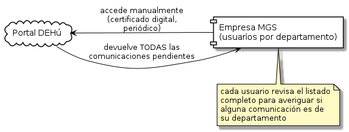

# Introducción

Este Trabajo de Fin de Máster se centra en el diseño e implementación de un sistema que automatiza la recepción y el tratamiento de las comunicaciones electrónicas que la Administración Pública española dirige a la empresa aseguradora MGS, Seguros y Reaseguros, S.A. Estas comunicaciones se depositan en la Dirección Electrónica Habilitada única (DEHú), que es el sistema oficial a través del cual los organismos públicos notifican electrónicamente a empresas y ciudadanos.

Hoy, el personal de la empresa accede a ellas de forma manual, una a una, mediante el certificado digital corporativo, accediendo directamente a DEHú. El proyecto sustituye este acceso manual por una conexión automatizada a DEHú mediante LEMA, la modalidad pensada para grandes empresas ("Grandes Destinatarios") que necesitan automatizar la consulta de sus comunicaciones [1].

El sistema implementado aporta valor en tres pasos manuales: la detección y descarga de cada comunicación nueva desde DEHú, la interpretación de su contenido mediante OCR y modelos LLM, y su derivación automática al departamento correspondiente a través del sistema de Ticketing interno de la empresa.

## Contexto

La relación entre las empresas y la Administración Pública española se canaliza, cada vez de forma más generalizada, a través de medios electrónicos. El artículo 14.2 de la Ley 39/2015, de 1 de octubre, del Procedimiento Administrativo Común de las Administraciones Públicas [2], obliga a las personas jurídicas a relacionarse electrónicamente con las Administraciones Públicas.

El Real Decreto 203/2021, de 30 de marzo, por el que se aprueba el Reglamento de actuación y funcionamiento del sector público por medios electrónicos [3], regula el sistema de notificaciones y comunicaciones electrónicas del que forma parte la Dirección Electrónica Habilitada única (DEHú): una plataforma que centraliza en un único buzón, por destinatario, las notificaciones de los organismos públicos que se han ido adhiriendo progresivamente a ella (miles de administraciones y organismos, en crecimiento continuo) [4].

No es, sin embargo, el único canal de notificación electrónica existente en la Administración española: determinados organismos mantienen sistemas de notificación propios, independientes de DEHú.

Recibir a tiempo estas comunicaciones no es una cuestión meramente operativa: muchas de ellas —requerimientos, notificaciones administrativas o incluso demandas judiciales— llevan asociados plazos legales cuyo incumplimiento puede tener consecuencias jurídicas y económicas directas para la organización.

En MGS Seguros, el acceso a estas comunicaciones se realiza actualmente de forma manual: distintos usuarios de diferentes áreas acceden periódicamente a DEHú —a diferencia del acceso automatizado que ofrece LEMA— empleando certificados digitales instalados localmente, habitualmente a través del enlace directo incluido en el correo de aviso de cada notificación; las notificaciones de DEHú también pueden consultarse a través de Mi Carpeta Ciudadana, el portal ciudadano que ofrece este acceso, entre otros trámites [5]. Los usuarios revisan la totalidad de las notificaciones pendientes: el sistema devuelve el listado completo sin distinguir por departamento, de modo que es el propio usuario quien actúa como filtro, examinando una a una todas las comunicaciones para determinar cuáles corresponden a su área, descargando la documentación asociada y trasladando manualmente esa información a los circuitos de trabajo internos correspondientes.

Este modelo presenta varias limitaciones relevantes. Por un lado, supone una carga operativa recurrente sobre tareas de bajo valor añadido, con el consiguiente riesgo de retrasos o comunicaciones no atendidas a tiempo. Por otro lado, el uso de certificados digitales instalados en múltiples puestos de trabajo, asociados a personas apoderadas de la organización, incrementa la superficie de exposición y dificulta la trazabilidad de los accesos. Además, la identificación del área destinataria y la naturaleza de cada comunicación depende del criterio manual de la persona que la revisa, sin un registro sistemático que permita auditar después cómo se gestionó cada caso (Figura 1).

**Figura 1.** Situación actual: acceso manual a DEHú.

## Motivación

Este proyecto surge de una necesidad real ya identificada dentro de la organización, alineada además con líneas de evolución tecnológica que la compañía tiene actualmente en marcha: una arquitectura orientada a eventos, la automatización de procesos mediante herramientas como n8n, la integración API-first entre sistemas y la incorporación progresiva de capacidades de inteligencia artificial aplicadas a procesos de negocio.

DEHú, a través de su modalidad de acceso para Grandes Destinatarios (LEMA), ofrece un conjunto de servicios web que permiten automatizar la detección y obtención de comunicaciones sin depender de la interacción manual con la sede electrónica, lo que abre la posibilidad de sustituir el proceso actual por un flujo automatizado y centralizado.

Combinando esta integración con técnicas de reconocimiento óptico de caracteres (OCR) y modelos de lenguaje (LLM) capaces de interpretar el contenido no estructurado de los documentos recibidos, es posible no solo automatizar la recepción, sino también la clasificación de cada comunicación y su derivación al departamento correspondiente a través del sistema de Ticketing ya utilizado internamente por la compañía.

A nivel personal, este trabajo responde también a un interés auténtico por las aplicaciones prácticas de la inteligencia artificial y por la automatización de procesos con herramientas como n8n, así como al deseo de aprender y poner en práctica conocimientos nuevos en un proyecto real. A ello se suma que la oportunidad de desarrollarlo en colaboración con MGS Seguros, dentro de una relación laboral remunerada con la empresa, surgió en el momento adecuado.

## Objetivos

El objetivo general de este trabajo es diseñar e implementar un sistema que automatice la recepción y el tratamiento de las comunicaciones electrónicas procedentes de la Administración Pública a través de LEMA[^1], aplicando inteligencia artificial para interpretar y clasificar su contenido, y que integre el resultado de dicha clasificación con el sistema interno de Ticketing de MGS Seguros, reduciendo la intervención manual actualmente necesaria y mejorando los tiempos de reacción y la trazabilidad del proceso.

De este objetivo general se derivan los siguientes objetivos específicos:

- Sustituir el acceso manual mediante certificados digitales instalados localmente por una integración automatizada con las APIs de LEMA, capaz de detectar y descargar por sí misma las comunicaciones y la documentación asociada.
- Interpretar y clasificar automáticamente el contenido de cada comunicación mediante inteligencia artificial (OCR y modelos de lenguaje), identificando su naturaleza, el organismo emisor y el área de negocio a la que corresponde.
- Generar eventos dentro de la arquitectura orientada a eventos ya existente en la compañía, de modo que la clasificación de una comunicación quede desacoplada de la acción concreta que se ejecuta sobre ella.
- Enrutar automáticamente cada comunicación clasificada hacia la cola de trabajo correspondiente del sistema de Ticketing interno —o, como canal alternativo, notificarla por correo electrónico—, evitando el traslado manual de información entre sistemas.
- Ofrecer un mecanismo de revisión humana para los casos en los que la clasificación automática no alcance el nivel de confianza necesario, explorando además que un agente de inteligencia artificial, apoyado en el protocolo MCP, pueda corregir sus propios errores de clasificación sin depender de la disponibilidad de un operador.
- Sentar una base escalable y reutilizable, alineada con las líneas de evolución tecnológica ya en marcha en la compañía (arquitectura orientada a eventos, automatización de procesos con n8n, integración API-first), que permita incorporar en el futuro nuevos organismos, tipos de comunicaciones y automatismos adicionales.

Estos objetivos se persiguen dentro del alcance de un Producto Mínimo Viable (MVP) centrado en el ciclo de recepción de comunicaciones; los límites concretos de dicho alcance se detallan en el apartado "Alcance y límites del diseño" del capítulo de especificación y diseño de la solución.

---

**Referencias citadas en este capítulo** (ver [`Referencias.md`](./Referencias.md) para el detalle completo):

1. Guía de integración para Grandes Destinatarios (AEAD, 2026, v3.0)
2. Ley 39/2015, art. 14.2 (BOE-A-2015-10565)
3. Real Decreto 203/2021 (BOE-A-2021-5032)
4. DEHú continúa su crecimiento... (IT User, 2023)
5. Mi Carpeta Ciudadana: Mis Notificaciones (carpetaciudadana.gob.es)

[^1]: DEHú es el sistema; LEMA es la forma automática de acceder a él.